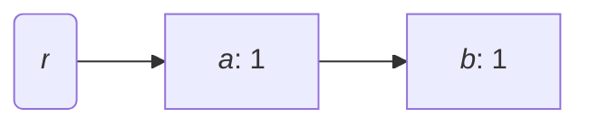
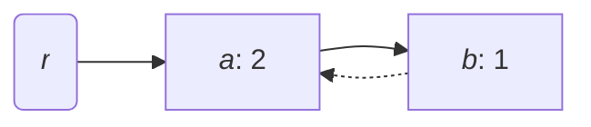

If carcinization is what happens when languages evolve to be more like Rust, then what do you call
it when Rust evolves to be more like Java? Caffeination?




Over this summer, I've had a decent amount of time to kill.
What better way to spend a beatiful hot summer than sitting inside, staring at core dumps in a
supposedly memory safe language?
I built a garbage collector - in short, a piece of software that manages allocations for another,
more exciting piece of software.
The more exciting part: I made it in Rust, for Rust - a language designed to eliminate garbage
collection and which provides few facilities for making it work properly.
Not only that, I managed to make my garbage collector work with relatively few compromises, which
I'll describe in further detail lower down.

## Background

If you're familiar with the details of Rust and its standard library, feel free to skip this
section.

The core backing behind Rust's memory model is _affine typing_ and the _borrow checker_.
Values may only be bound to one identifier at a time, and borrows (a.k.a. references) may not outlive
the scope binding their referent.

For example, the following code is invalid:

```rust
let x = vec![1, 2, 3];
let y = x;
println!("{x:?}"); // compile error - x has already been moved
```

Normally, we work around this by borrowing against a binding, such as by making `y = &x` in the
example above.
However, we often need to share some heap-allocated value without knowing which binding will live
the longest.
The solution to this problem is shared ownership via garbage collection.

Rust's standard library offers two simple reference-counted garbage collectors: the single-threaded
[`Rc`](https://doc.rust-lang.org/std/rc/index.html) and its atomically-indexed counterpart
[`Arc`](https://doc.rust-lang.org/std/sync/struct.Arc.html).
They operate by maintining a reference count in each heap allocation.
Under most circumstances, these work great, but they can't handle cyclic references.
Combined with interior mutability, it's trivial to refute them.

```rust
use std::{cell::OnceCell, rc::Rc};
struct Foo(OnceCell<Rc<Foo>>);

let x = Rc::new(Foo(OnceCell::new()));
x.0.set(Rc::clone(&x));
// My foo has a reference to itself. It can never be freed!
```

This is why people actually get paid money to build garbage collectors.
If using a reference counter were all you needed, a number of people working at Oracle would be out
of a job.

## Battle plan

We'd like to create some `Gc` data structure with a similar API to `Rc` and `Arc`, which can accept
nearly any data type contained within, and still manage to detect and collect cycles.

We have a few weapons at our disposal:

- **`Drop`**: Every non-copiable data type in Rust can implement the `Drop` trait to ensure some
  code is called every time it is dropped.
  In our case, we can implement `Drop` for `Gc` to try to glean some knowledge about when an
  allocation becomes inaccessible.
- **Traits**: We can construct some trait (in our case, let's call it `Collectable`) as a mandatory
  requirement to be contained in a `Gc`.
  Creating this trait has some major downsides (libraries upstream of `dumpster` can't implement it)
  but it's a necessary evil.

However, our formidable tools are matched by equally formidable challenges:

- **Undetectable moves**. When a value is moved in Rust, there is no way to detect that fact from
  within that value.
  If we had some sort of trait like `OnMove` which could allow for a function to be called every
  time it had moved, we could use it to detect when a `Gc` moved inside another `Gc`, making it
  unrooted, and allowing us to create a simple mark-sweep collector.
  At this rate, though, we would just be inventing C++'s copy constructors.
- **Variable-sized data**. I foolishly decided to make it so that `Gc` could store `?Sized` types,
  which is more flexible for library users (enabling things like `Gc<dyn MyTrait>` and `Gc<[T]>`.
- **Type erasure**. In a typical Rust program, generics are implemented via monomorphization, and
  no type information is retained at runtime.
  This makes it harder to effectively clean up an allocation once it's done.

With these two, relatively simple tools, we have enough to build a collector which can handle just
about any data type inside.

## My approach

We need to be able to detect whether a `Gc` is reachable without actually scanning the stack.
I'll start with a few definitions, using graph-theoretical language.

1. An allocation graph \\(G = (V, E, r)\\) is a directed graph with a root node \\(r \in V\\) whose
   indegree is zero.
1. A node \\(v\\) in an allocation graph is said to be _accessible_ if and only if there exists a
   path from \\(r\\) to \\(v\\) in the graph.

It should be clear to see why these definitions are useful to us.
We can imagine each node being one allocation, pretending that all data not indirected through a
`Gc` is part of an imaginary allocation for the root.
Additionally, each `Gc` acts as an edge connecting the allocation containing it to the allocation it
points to.
If an allocation is accessible in the graph-theoretical sense, it's still possible for a program to
reach it, and if not, it's safe to free that allocation.
Note that the indegree of a node is exactly equal to the reference count of its corresponding
allocation.

I'll roughly outline our approach to determining whether some node \\(n: \neq r\\) is accessible.

1. Find \\(W\\), the set of all descendants of \\(n\\).
   Construct the subgraph \\(H\\) of \\(G\\) whose vertex set is \\(W\\), preserving all edges
   from \\(W\\) to \\(W\\).
1. Find the set of nodes \\(A \subseteq W\\) for which the indegree of each \\(a \in A\\) in \\(H\\)
   is _not_ equal to its indegree in \\(G\\).
1. For each \\(a \in A\\), mark it and its descendants as accessible.
1. If and only if \\(n\\) was marked as accessible, it is accessible.

Here's a serpentine implementation in pseudocode, if that's what you prefer.

```py
def is_accessible(n):
    counts = {n: n.indegree()}
    for (_, m) in n.edges():
        dfs(m, counts)

    reachable = set()
    for (a, count) in counts:
        if count == 0:
            sweep(a, reachable)

    return n in reachable


def dfs(n, counts):
    if n not in counts.keys():
        counts[n] = n.indegree()
        for (_, m) in n.edges():
            dfs(m, counts)

    counts[n] -= 1


def sweep(a, reachable):
    if a not in reachable:
        reachable.add(a)
        for (_, b) in a.edges():
            sweep(b, reachable)
```

It should be pretty clear to see that `is_accessible` runs in \\(O(\|V\| + \|E\|)\\) time.

### Reference counting with extra steps

Our single-threaded `Gc` will behave a lot like an `Rc`, but with some small details changed.

First, we define a `Gc` and the allocation it points to, a `GcBox`.

```rust
pub struct Gc<T: ?Sized> {
    ptr: NonNull<GcBox<T>>
}

#[repr(C)]
struct GcBox<T: ?Sized> {
    ref_count: Cell<usize>,
    value: T
}
```

We can then hook into the `Drop` behavior for our `Gc` to make it all work.

```rust
impl<T: ?Sized> Drop for Gc<T> {
    fn drop(&mut self) {
        unsafe {
            let box_ref = self.ptr.as_ref();
            match box_ref.ref_count.get() {
                0 => (),
                n => {
                    box_ref.ref_count.set(n - 1);
                    if n == 1 || !is_accessible(box_ref) {
                        box_ref.ref_count.set(0);
                        drop_in_place(addr_of_mut!(ptr.as_mut().value));
                        dealloc(ptr.as_ptr().cast(), Layout::for_value(ptr.as_ref()));
                    }
                }
            }
        }
    }
}
```

I, being very clever, decided to use a sentinel value of 0 for the reference count when an
allocation is being cleaned up (to prevent spurious double-frees).

However, this code has a problem - how the hell are we supposed to implement `is_accessible`?

### Trait hackery

Our pseudocode for `is_accessible` required us to be able to access the set of edges going out from
a node.
Doing so is kind of hard.
If we were writing this in C, we would scan the allocation on the heap, looking for data that
looked like they could be pointers into other allocations.
In Rust, though, we can be a lot more precise by adding a small constraint onto every
garbage-collected type.

If the garbage collector wasn't enough, we're bringing the visitor pattern over from Java.
We force every garbage-collected value to implement the `Collectable` trait, which will delegate
some `Visitor` to each of its garbage-collected fields.

```rust
pub struct Gc<T: Collectable + ?Sized> {
   // same as before ...
}

pub trait Collectable {
    fn accept<V: Visitor>(&self, visitor: &mut V);
}

pub trait Visitor {
    fn visit_gc<T: Collectable + ?Sized>(&mut self, gc: &Gc<T>);
}
```

For example, an array might implement it by delegating to `accept` on each of its elements.

```rust
impl<T: Collectable> Collectable for [T] {
    fn accept<V: Visitor>(&self, visitor: &mut V) {
        self.iter().for_each(|elem| elem.accept(visitor));
    }
}
```

We can now write code that finds the outgoing edges from each allocation by simply applying a
visitor to the allocation.
I ended up writing two visitors - one for the `dfs` step and one for the `sweep` step.

### Bulk dropping

A cursory analysis of the implementation of `Drop` above shows that the call to `is_accessible` runs
in linear time with respect to the total number of `Gc`s existing.
You would be excused for thinking that `drop`, as written, runs in linear time.
However, the call to `drop_in_place` could also result in another `Gc` being dropped, yielding
a quadratic-time cleanup.
This is unacceptable, especially since our first call to `is_accessible` actually did all the work
of determining whether the allocations arereachable from the original one - if the original
allocation being freed was inaccessible, any allocation referred to by it should also be
inaccessible.

We can save our time on sweeping by a pretty simple method: we'll do one more pass through the
reference graph, recording a pointer to each allocation to be destroyed and its implementation of
`drop`. Then, once we've found every inaccessible allocation, we'll drop them all in one quick go.

There's one final problem, though: each `Gc` owned by a dropped value could itself try to manipulate
the reference counts of its pointees, resulting in undefined behavior, or worse, slow code.
However, all problems in computer science can be solved by adding more state or more indirection.
We opt to solve it with extra state this time, creating a thread-local value called `COLLECTING`.

When we do a bulk-drop, we set `COLLECTING` to `true`.
Then, when we call `drop` on a `Gc`, it checks the state of `COLLECTING`.
If `COLLECTING` is true, the `Gc` does nothing when dropped (not even affecting its reference
count).
To handle outbound edges to still-accessible allocations, we add one more sweep before the final
cleanup to handle outbound edges.

Let's take a look at what the code for that roughly looks like now.

```rust
thread_local! {
    static COLLECTING: Cell<bool> = Cell::new(false);
}

impl<T: Collectable + ?Sized> Drop for Gc<T> {
    fn drop(&mut self) {
        if COLLECTING.with(Cell::get) { return; }
        let box_ref = unsafe { self.ptr.as_ref() };
        match box_ref.ref_count.get() {
            0 => (),
            1 => {
                box_ref.ref_count.set(0);
                unsafe {
                    drop_in_place(addr_of_mut!(ptr.as_mut().value));
                    dealloc(ptr.as_ptr().cast(), Layout::for_value(ptr.as_ref()));
                }
            }
            n => {
                box_ref.ref_count.set(n - 1);
                unsafe { cleanup(self.ptr) };
            }
        }
    }
}
```

`cleanup` is the function we'll write to check if the allocation is accessible and perform a bulk
cleanup if needed.
There's one more problem before we can implement `cleanup`, though: our psuedocode required us to be
able to store each allocation as a key in `counts` and also to access the allocation's neighbors.
This means we have to use a little bit of type erasure to achieve our ends.
I won't go into too much detail, but we need to be able to do two things:

- Store pointers to allocations as keys in a hash-map.
- Reconstruct a stored pointer using type information to make it possible to do work.

Due to the limitations of Rust, these are actually mutually exclusive.
Because it's undefined behavior (due to provenance issues) to compare the raw data in pointers, we
can't erase a pointer and then use it as a key in a hash-map.
However, we can't just get a pointer to the first byte of the allocation, because our allocation
could be `?Sized`.

As a result, my implementation actually has two different kinds of erased pointers: a thin pointer
which can be used for comparisons and a fat pointer which can be used to reconstruct a pointer to
any type.

```rust
struct AllocationId(NonNull<Cell<usize>>); // used as a key in hash-maps
struct ErasedPtr([usize; 2]);              // used as a reconstructible pointer to the allocation
```

Then, all the functions which need to know the type information of the allocation (such as `dfs` and
`sweep`) can be stored opaquely as function pointers, and when called, they can "rehydrate" the
`ErasedPtr` passed in with type information.

Below, I've included an example of how it can be used to implement `dfs`.

```rust
unsafe fn dfs<T: Collectable + ?Sized>(ptr: ErasedPtr, counts: &mut HashMap<AllocationId, usize>) {
    struct DfsVisitor<'a> {
       counts: &'a mut HashMap<AllocationId, usize>,
    }

    impl Visitor for DfsVisitor<'_> {
        fn visit_gc<U>(&mut self, gc: &Gc<U>) {
            let id = AllocationId::new(gc.ptr);

            if counts.insert(id, gc.ptr.as_ref().ref_count.get()) {
                (**gc).accept(self);
            }

            *counts.get_mut(&id).unwrap() -= 1;
        }
    }
    // pretend that `specify` converts the pointer back into NonNull<T>
    let specified = ptr.specify::<T>();
    specified.as_ref().accept(DfsVisitor { counts });
}
```

I won't include the implementation of `cleanup` here because it's lengthy and also not even the
final revision of the cleanup algorithm, but you can trust me that it works.
After much gnashing of teeth and tearing of hair, this is finally enough to achieve bulk dropping,
making calling `drop()` on a `Gc` a linear-time operation.

### Amortizing

What's that, you say?
You need your reference operations to work in \\(O(1)\\) time?
Why are programmers these days so picky?

Luckily, it isn't too hard to make our garbage-collection efforts terminate in average-case
\\(O(1)\\) time.
Instead of calling `cleanup` directly, we'll just punt the allocation, which may be inaccessible,
into a set of "dirty" allocations.
In my code, I call that set a dumpster.
Then, once every \\(|E|\\) times an allocation is dropped, we'll go through the whole dumpster and
sweep them all in \\(O(|E|)\\) time.
Amortized across all allocations, that's technically \\(O(1)\\), enabled by the same accounting
wizardry that makes array-backed lists useful and that caused the 2008 financial crisis.

To save ourselves a little bit of work, whenever an allocation is accessed (such as by dereferencing
or cloning) we can yank the allocation away from that same dirty set, since it was just proven to be
accessible.

## Are we concurrent yet?

So far, the garbage collector I've been outlining to you has been a single-threaded collector, which
can only store thread-local garbage-collected values.
I'm told that all code worth writing ends up being concurrent, so we have to do better than that.
Lucky for us, this algorithm can be made to operate concurrently with little effort, assuming that
only one thread collects at a time.

However, even if only one thread is collecting, we can still run into some nasty concurrency issues.
Let's imagine that we have 2 allocations, \\(a\\) and \\(b\\), plus the imaginary "root" allocation
\\(r\\), where \\(a\\) can only be accessed from \\(r\\) and \\(b\\) can only be accessed from
\\(a\\).



Now, consider performing a depth-first search starting from \\(a\\).
First, we record that \\(a\\) has 1 unaccounted-for-reference in `counts`.
Then, we move on to looking at \\(b\\) because it's one of \\(a\\)'s children.

However, between when we record \\(a\\)'s reference count and examine \\(b\\), another malicious
thread mutates \\(b\\), adding a back-reference from \\(b\\) to \\(a\\).



Then, the depth-first search will return to \\(a\\), decrement the number of unaccounted references,
and assume that all incoming references to \\(a\\) and \\(b\\) were totally accounted for (and
therefore inaccessible).
Then the garbage collector would happily destroy \\(a\\) and \\(b\\)'s allocations, leaving a
dangling reference to the heap, potentially causing a use-after-free or other gnarly memory errors.

### Locking it down

The simplest solution to this concurrency issue is to just wrap everything in a big fat lock by
forcing every single operation involving a `Gc` to acquire a single global mutex, preventing any
sort of concurrency bugs at all.
However, that's ridiculously slow.

We'd like to have an approach which only needs to achieve mutual exclusion over a small subset of
all allocations if at all possible.
To do so, let's take a closer look at our concurrency problem: we can see that we only really get
erroneous results when another thread mutates the subgraph \\(H\\) as we interact with it.
The solution: wrap every allocation's reference count in a mutex.
This means that other threads can do any operation they want with any allocations outside the
reference graph, and they can even interact with the data inside the allocations we examine.

We can start by rewriting `GcBox`.

```rust
#[repr(C)]
struct GcBox<T: Collectable + Sync + ?Sized> {
    ref_count: Mutex<usize>,
    value: T,
}
```

Then, when performing `dfs`, the collection algorithm can lock the mutex for every allocation it
visits, and retain the mutex guard until `dfs` is complete.
This means that other threads cannot mutate an allocation between when its reference count is
recorded and when the reference subgraph is completed.

### It's the weak ones that count

There's one more cause for memory safety issues from concurrency.
If an allocation is freed because its reference count reached zero, it could still be accessible
by another thread because it was stored in the global dumpster.
We can't guarantee that we've obliterated all references to that allocation from every other
thread's memory, so it seems like we're hosed.

However, there's no problem in computer science that can't be solved by adding more state.
Taking a leaf from `Rc`'s book and adapting it liberally, we annotate each allocation with a "weak"
reference count, which is the number of times it's referenced by a dumpster or cleanup thread.

```rust
struct RefCounts {
    strong: usize,
    weak: usize,
}

#[repr(C)]
struct GcBox<T: Collectable + Sync + ?Sized> {
    ref_count: Mutex<RefCounts>,
    value: T,
}
```

Then, when dropping the last strong reference to a `Gc`, we first check that its weak reference
count is nonzero before we can deallocate it.
If not, it's the cleanup threads' problem to take care of it.

### Deadlocked!

There's one final problem for us to solve (I promise!).
Imagine that we want to create a `Gc<Mutex<()>>`, and then drop a `Gc` pointing to it while we hold
it.

```rust
let gc1 = Gc::new(Mutex::new(()));
let gc2 = gc1.clone();

let guard = gc1.lock()?;
drop(gc2); // suppose this triggers a cleanup
drop(guard);
```

While sweeping the reference graph, the `dfs` visitor would attempt to visit the mutex, lock it,
and try to carry on.
However, since the same thread that triggered the allocation still holds a guard to that mutex, the
thread would deadlock disastrously.
Lucky for us, we know that any allocation with a held mutex guard must be still accessible (due to
`Mutex`'s excellent API), so we can be certain that if we fail to acquire a mutex, we have immediate
proof that an allocation is accessible.

To take advantage of that, we'll make visiting a collectable type a fallible operation, and make it
so that failing to acquire a lock also fails the visit.

```rust
pub trait Collectable {
    fn accept<V: Visitor>(&self, visitor: &mut V) -> Result<(), ()>;
}

pub trait Visitor {
    fn visit_gc<T: Collectable + ?Sized>(&mut self, gc: &Gc<T>) -> Result<(), ()>;
}

impl<T: Collectable + ?Sized> Collectable for Mutex<T> {
    fn accept<V: Visitor>(&self, visitor: &mut V) -> Result<(), ()> {
        // pretend poison errors don't exist
        self.try_lock().map_err(|_| ())?.accept(visitor);
        Ok(())
    }
}
```
