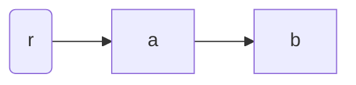
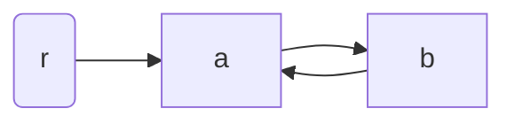
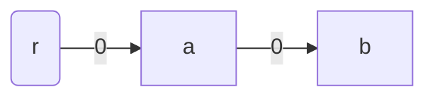
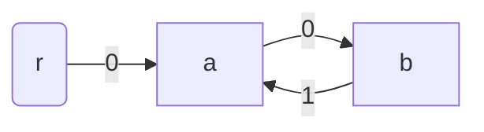
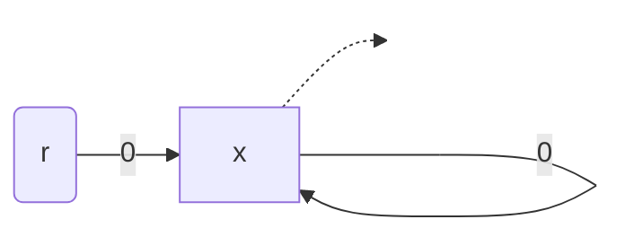
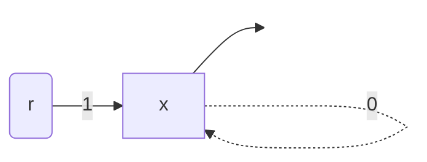
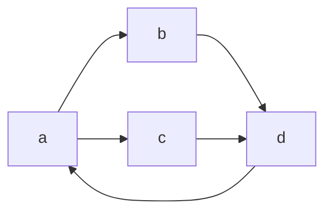
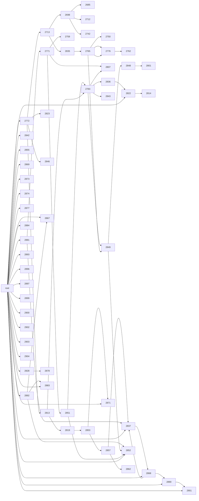

If carcinization happens when languages evolve to be more like Rust, then what do you call
it when Rust evolves to be more like Java? Caffeination?




Over this summer, I've had a decent amount of time to kill.
What better way to spend a beautiful hot summer than sitting inside, staring at core dumps in a
supposedly memory-safe language?
I built a garbage collector - in short, a piece of software that manages allocations for another,
more exciting piece of software.
The cool part: I made it in Rust, for Rust - a language designed to eliminate garbage
collection and which provides few facilities for making it work properly.
Not only that, I managed to make my garbage collector work with relatively few compromises, which
I'll describe in further detail lower down.

If you don't like reading, don't care about the journey to implement it, or just want to get a
sales pitch for the final result, check out the source code on GitHub
[here](https://github.com/claytonwramsey/dumpster).

## Background

If you're familiar with the details of Rust and its standard library, feel free to skip this
section.

The core backing behind Rust's memory model is _affine typing_ and the _borrow checker_.
Values may only be bound to one identifier at a time, and borrows (a.k.a. references) may not
outlive the scope binding their referent.

For example, the following code is invalid:

```rust
let x = vec![1, 2, 3];
let y = x;
println!("{x:?}"); // compile error - x has already been moved
```

Normally, we work around this by borrowing against a binding, such as by making `y = &x` in the
example above.
However, we often need to share some heap-allocated value without knowing which binding will live
the longest.
The solution to this problem is shared ownership via garbage collection.

Rust's standard library offers two simple reference-counted garbage collectors: the single-threaded
[`Rc`](https://doc.rust-lang.org/std/rc/index.html) and its atomically-indexed counterpart
[`Arc`](https://doc.rust-lang.org/std/sync/struct.Arc.html).
They operate by maintaining a reference count in each heap allocation.
Under most circumstances, these work great, but they can't handle cyclic references.
Combined with interior mutability, it's trivial to refute them.

```rust
use std::{cell::OnceCell, rc::Rc};
struct Foo(OnceCell<Rc<Foo>>);

let x = Rc::new(Foo(OnceCell::new()));
x.0.set(Rc::clone(&x));
// My foo has a reference to itself. It can never be freed!
```

This is why people actually get paid money to build garbage collectors.
If using a reference counter were all you needed, a number of people working at Oracle would be out
of a job.

## Battle plan

We'd like to create some `Gc` data structure with a similar API to `Rc` and `Arc`, which can accept
nearly any data type contained within, and still manage to detect and collect cycles.

We have a few weapons at our disposal:

- **`Drop`**: Every non-copiable data type in Rust can implement the `Drop` trait to ensure some
  code is called every time it is dropped.
  In our case, we can implement `Drop` for `Gc` to try to glean some knowledge about when an
  allocation becomes inaccessible.
- **Traits**: We can construct some trait (in our case, let's call it `Collectable`) as a mandatory
  requirement to be contained in a `Gc`.
  Creating this trait has some major downsides (libraries upstream of `dumpster` can't implement it)
  but it's a necessary evil.

However, our formidable tools are matched by equally formidable challenges:

- **Undetectable moves**. When a value is moved in Rust, there is no way to detect that fact from
  within that value.
  If we had some sort of trait like `OnMove` which could allow for a function to be called every
  time it had moved, we could use it to detect when a `Gc` moved inside another `Gc`, making it
  unrooted, and allowing us to create a simple mark-sweep collector.
  At this rate, though, we would just reinvent C++'s copy constructors.
- **Variable-sized data**. I foolishly decided to make it so that `Gc` could store `?Sized` types,
  which is more flexible for library users (enabling things like `Gc<dyn MyTrait>` and `Gc<[T]>`.
- **Type erasure**. In a typical Rust program, generics are implemented via monomorphization, and
  no type information is retained at runtime.
  This makes it harder to clean up an allocation without prior context.

With these two, relatively simple tools, we have enough to build a collector which can handle just
about any data type inside.

## My approach

We need to detect whether a `Gc` is reachable without actually scanning the stack.
I'll start with a few definitions, using graph-theoretical language.

1. An allocation graph \\(G = (V, E, r)\\) is a directed graph with a root node \\(r \in V\\) whose
   indegree is zero.
1. A node \\(v\\) in an allocation graph is said to be _accessible_ if and only if there exists a
   path from \\(r\\) to \\(v\\) in the graph.

It should be clear to see why these definitions are useful to us.
We can imagine each node being one allocation, pretending that all data not indirected through a
`Gc` is part of an imaginary allocation for the root.
Additionally, each `Gc` acts as an edge connecting two allocations.
If an allocation is accessible in the graph-theoretical sense, it's still possible for a program to
reach it, and if not, it's safe to free that allocation.
Note that the indegree of a node is precisely equal to the reference count of its corresponding
allocation.

I'll roughly outline our approach to determining whether some node \\(n: \neq r\\) is accessible.

1. Find \\(W\\), the set of all descendants of \\(n\\).
   Construct the subgraph \\(H\\) of \\(G\\) whose vertex set is \\(W\\), preserving all edges
   from \\(W\\) to \\(W\\).
1. Find the set of nodes \\(A \subseteq W\\) for which the indegree of each \\(a \in A\\) in \\(H\\)
   is _not_ equal to its indegree in \\(G\\).
1. For each \\(a \in A\\), mark it and its descendants as accessible.
1. If and only if \\(n\\) was marked as accessible, it is accessible.

Here's a serpentine implementation in pseudocode, if that's what you prefer.

```py
def is_accessible(n):
    counts = {n: n.indegree()}
    for (_, m) in n.edges():
        dfs(m, counts)

    reachable = set()
    for (a, count) in counts:
        if count != 0:
            mark(a, reachable)

    return n in reachable


def dfs(n, counts):
    if n not in counts.keys():
        counts[n] = n.indegree()
        for (_, m) in n.edges():
            dfs(m, counts)

    counts[n] -= 1


def mark(a, reachable):
    if a not in reachable:
        reachable.add(a)
        for (_, b) in a.edges():
            mark(b, reachable)
```

It should be pretty clear to see that `is_accessible` runs in \\(O(\|V\| + \|E\|)\\) time.

### Reference counting with extra steps

Our single-threaded `Gc` will behave much like an `Rc`, but with some minor details changed.

First, we define a `Gc` and the allocation it points to, a `GcBox`.

```rust
pub struct Gc<T: ?Sized> {
    ptr: NonNull<GcBox<T>>
}

#[repr(C)]
struct GcBox<T: ?Sized> {
    ref_count: Cell<usize>,
    value: T
}
```

We can then hook into the `Drop` behavior for our `Gc` to make it all work.

```rust
impl<T: ?Sized> Drop for Gc<T> {
    fn drop(&mut self) {
        let box_ref = unsafe { self.ptr.as_ref() };
        match box_ref.ref_count.get() {
            0 => (),
            n => {
                box_ref.ref_count.set(n - 1);
                if n == 1 || !is_accessible(box_ref) {
                    box_ref.ref_count.set(0);
                    unsafe {
                        drop_in_place(addr_of_mut!(ptr.as_mut().value));
                        dealloc(ptr.as_ptr().cast(), Layout::for_value(ptr.as_ref()));
                    }
                }
            }
        }
    }
}
```

I, being very clever, decided to use a sentinel value of 0 for the reference count when an
allocation is being cleaned up (to prevent spurious double-frees).

However, this code has a problem - how the hell are we supposed to implement `is_accessible`?

### Trait hackery

Our pseudocode for `is_accessible` required us to be able to access the set of edges going out from
a node.
Doing so is kind of hard.
If we were writing this in C, we would scan the allocation on the heap, looking for data that
looked like they could be pointers into other allocations.
In Rust, though, we can be a lot more precise by adding a small constraint to every
garbage-collected type.

If the garbage collector wasn't enough, we're bringing the visitor pattern over from Java.
We force every garbage-collected value to implement the `Collectable` trait, which will delegate
some `Visitor` to each of its garbage-collected fields.

```rust
pub struct Gc<T: Collectable + ?Sized> {
   // same as before ...
}

pub trait Collectable {
    fn accept<V: Visitor>(&self, visitor: &mut V);
}

pub trait Visitor {
    fn visit_gc<T: Collectable + ?Sized>(&mut self, gc: &Gc<T>);
}
```

For example, an array might implement it by delegating to `accept` on each of its elements.

```rust
impl<T: Collectable> Collectable for [T] {
    fn accept<V: Visitor>(&self, visitor: &mut V) {
        self.iter().for_each(|elem| elem.accept(visitor));
    }
}
```

We can now write code that finds the outgoing edges from each allocation by simply applying a
visitor to the allocation.
I ended up writing two visitors - one for the `dfs` step and one for the `mark` step.

I would have liked to make `Collectable` object-safe, but that would also require `Visitor` to be
object safe.
That, in turn, would cause every garbage collector to be coercible to `Gc<dyn Collectable>`, which
would only be possible on nightly, making it impossible to write a stable crate.

### Bulk dropping

A cursory analysis of the implementation of `Drop` above shows that the call to `is_accessible` runs
in linear time with respect to the total number of `Gc`s existing.
You would be excused for thinking that `drop`, as written, runs in linear time.
However, the call to `drop_in_place` could also result in another `Gc` being dropped, yielding
a quadratic-time cleanup.
This is unacceptable, especially since our first call to `is_accessible` actually did all the work
of determining whether the allocations are reachable from the original one - if the original
allocation being freed was inaccessible, any allocation referred to by it should also be
inaccessible.

We can save our time on marking by a pretty simple method: we'll do one more pass through the
reference graph, recording a pointer to each allocation to be destroyed and its implementation of
`drop`. Then, once we've found every inaccessible allocation, we'll drop them all in one quick go.

There's one final problem, though: each `Gc` owned by a dropped value could itself try to manipulate
the reference counts of its pointees, resulting in undefined behavior, or worse, slow code.
However, all problems in computer science can be solved by adding more state or more indirection.
We opt to solve it with extra state this time, creating a thread-local value called `COLLECTING`.

When we do a bulk-drop, we set `COLLECTING` to `true`.
Then, when we call `drop` on a `Gc`, it checks the state of `COLLECTING`.
If `COLLECTING` is true, the `Gc` does nothing when dropped (not even affecting its reference
count).
To handle outbound edges to still-accessible allocations, we add one more traversal before the final
cleanup to handle outbound edges.

Let's take a look at what the code for that roughly looks like now.

```rust
thread_local! {
    static COLLECTING: Cell<bool> = Cell::new(false);
}

impl<T: Collectable + ?Sized> Drop for Gc<T> {
    fn drop(&mut self) {
        if COLLECTING.with(Cell::get) { return; }
        let box_ref = unsafe { self.ptr.as_ref() };
        match box_ref.ref_count.get() {
            0 => (),
            1 => {
                box_ref.ref_count.set(0);
                unsafe {
                    drop_in_place(addr_of_mut!(ptr.as_mut().value));
                    dealloc(ptr.as_ptr().cast(), Layout::for_value(ptr.as_ref()));
                }
            }
            n => {
                box_ref.ref_count.set(n - 1);
                unsafe { cleanup(self.ptr) };
            }
        }
    }
}
```

`cleanup` is the function we'll write to check if the allocation is accessible and perform a bulk
cleanup if needed.
There's one more problem before we can implement `cleanup`, though: our psuedocode required us to be
able to store each allocation as a key in `counts` and also to access the allocation's neighbors.
This means we have to use a little bit of type erasure to achieve our ends.
I won't go into too much detail, but we need to be able to do two things:

- Store pointers to allocations as keys in a hash-map.
- Reconstruct a stored pointer using type information to make it possible to do work.

Due to the limitations of Rust, these are actually mutually exclusive.
Because it's undefined behavior (due to provenance issues) to compare the raw data in pointers, we
can't erase a pointer and then use it as a key in a hash-map.
However, we can't just get a pointer to the first byte of the allocation, because our allocation
could be `?Sized`.

As a result, my implementation actually has two different kinds of erased pointers: a thin pointer
which can be used for comparisons and a fat pointer which can be used to reconstruct a pointer to
any type.

```rust
struct AllocationId(NonNull<Cell<usize>>); // used as a key in hash-maps
struct ErasedPtr([usize; 2]);              // used as a reconstructible pointer to the allocation
```

Then, all the functions which need to know the type information of the allocation (such as `dfs` and
`mark`) can be stored opaquely as function pointers, and when called, they can "rehydrate" the
`ErasedPtr` passed in with type information.

Below, I've included an example of how it can be used to implement `dfs`.

```rust
unsafe fn dfs<T: Collectable + ?Sized>(ptr: ErasedPtr, counts: &mut HashMap<AllocationId, usize>) {
    struct DfsVisitor<'a> {
       counts: &'a mut HashMap<AllocationId, usize>,
    }

    impl Visitor for DfsVisitor<'_> {
        fn visit_gc<U>(&mut self, gc: &Gc<U>) {
            let id = AllocationId::new(gc.ptr);

            if counts.insert(id, unsafe { gc.ptr.as_ref().ref_count.get() }) {
                (**gc).accept(self);
            }

            *counts.get_mut(&id).unwrap() -= 1;
        }
    }
    // pretend that `specify` converts the pointer back into NonNull<T>
    let specified = ptr.specify::<T>();
    specified.as_ref().accept(DfsVisitor { counts });
}
```

I won't include the implementation of `cleanup` here because it's lengthy and not even the
final revision of the cleanup algorithm, but you can trust me that it works.
After much gnashing of teeth and tearing of hair, this is finally enough to achieve bulk dropping,
making calling `drop()` on a `Gc` a linear-time operation.

### Amortizing

What's that, you say?
You need your reference operations to work in \\(O(1)\\) time?
Why are programmers these days so picky?

Luckily, it isn't too hard to make our garbage-collection efforts terminate in average-case
\\(O(1)\\) time.
Instead of calling `cleanup` directly, we'll just punt the allocation, which may be inaccessible,
into a set of "dirty" allocations.
In my code, I call that set a dumpster.
Then, once every \\(|E|\\) times an allocation is dropped, we'll go through the whole dumpster and
collect them all in \\(O(|E|)\\) time.
Amortized across all allocations, that's technically \\(O(1)\\), enabled by the same accounting
wizardry that makes array-backed lists useful and that caused the 2008 financial crisis.

To save ourselves a little bit of work, whenever an allocation is accessed (such as by dereferencing
or cloning), we can yank the allocation away from that same dirty set since it was just proven to be
accessible.

## Are we concurrent yet?

So far, the garbage collector I've been outlining to you has been a single-threaded collector, which
can only store thread-local garbage-collected values.
I'm told that all code worth writing ends up being concurrent, so we have to do better than that.
Lucky for us, this algorithm can be made to operate concurrently with little effort, assuming that
only one thread collects at a time.

However, even if only one thread is collecting, we can still run into some nasty concurrency issues.
Let's imagine that we have 2 allocations, \\(a\\) and \\(b\\), plus the imaginary "root" allocation
\\(r\\), where \\(a\\) can only be accessed from \\(r\\) and \\(b\\) can only be accessed from
\\(a\\).



Now, consider performing a depth-first search starting from \\(a\\).
First, we record that \\(a\\) has 1 unaccounted-for-reference in `counts`.
Then, we move on to looking at \\(b\\) because it's one of \\(a\\)'s children.

However, between when we record \\(a\\)'s reference count and examine \\(b\\), another malicious
thread mutates \\(b\\), adding a back-reference from \\(b\\) to \\(a\\).



Then, the depth-first search will return to \\(a\\), decrement the number of unaccounted references,
and assume that all incoming references to \\(a\\) and \\(b\\) were totally accounted for (and
therefore inaccessible).
Then the garbage collector would happily destroy \\(a\\) and \\(b\\)'s allocations, leaving a
dangling reference to the heap, potentially causing a use-after-free or other gnarly memory errors.

### Resolving concurrency

The simplest solution to this concurrency issue is to just wrap everything in a big fat lock by
forcing every single operation involving a `Gc` to acquire a single global mutex, preventing any
sort of concurrency bugs at all.
However, that's ridiculously slow.

We'd like to have an approach that only needs to achieve mutual exclusion over a small subset of
all allocations if at all possible.
To do so, let's take a closer look at our concurrency problem: we can see that we only really get
erroneous results when another thread mutates the subgraph \\(H\\) as we interact with it.
The solution is quite clever - we tag every `Gc` with a special number, which I'll call a collecting
tag.

First, we'll add a global atomic integer called the `COLLECTING_TAG`.

```rust
static COLLECTING_TAG: AtomicUsize = AtomicUsize::new(0);
```

Whenever we create or clone a new `Gc`, we'll annotate it with the current value of
`COLLECTING_TAG`.

```rust
// this new `Gc` type is intended to be `Sync`.

pub struct Gc<T: Collectable + Sync + ?Sized> {
    ptr: NonNull<GcBox<T>>,
    tag: AtomicUsize,
}

impl <T: Collectable + Sync + ?Sized> Gc<T> {
    pub fn new(x: T) -> Gc<T> {
        // (other bookkeeping hidden)

        Gc {
            ptr: /* initialization of GcBox<T> */,
            tag: COLLECTING_TAG.load(Ordering::Relaxed),
        }
    }
}
```

Next, at the start of the collection process, we'll increment the value of `COLLECTING_TAG` just
before we call `dfs`.

```rust
fn collect() {
    COLLECTING_TAG.fetch_add(1, Ordering::Relaxed);
    // carry on with DFS and such
}
```

Lastly, whenever we encounter a `Gc` during the `dfs` process, we'll check its tag.
If the tag is equal to the current value of `COLLECTING_TAG`, that means the `Gc` was created after
`dfs` started.
If so, then whatever spot we found the `Gc` in must have been accessible, and we can mark it as so.
To prevent us from visiting the same edge twice (due to shenanigans), we'll also update the tag
on every edge we visit to the value of `COLLECTING_TAG`.

Let's return to our broken example to show how this modification fixes it.
We return to our reference graph with \\(a\\) pointing to \\(b\\) and \\(r\\) pointing to \\(a\\).
Since every `Gc` must be annotated with a tag, let's say they're all tagged with 0.



Next, when `dfs` begins, `COLLECTING_TAG` is incremented to 1.
As a result, the new reference created by a malicious thread must be tagged with 1.



Now, when `dfs` visits the edge pointing from \\(b\\) to \\(a\\), it sees that the reference is
labeled with a tag of 1, and therefore both \\(b\\) and \\(a\\) must be accessible - no accidental
early deallocations here.

### Moving in and out

We might hope that tagging the pointers is sufficient to prevent all concurrency bugs.
However, this is sadly not enough.
To show why, we'll begin with an example.

First, let's imagine an allocation called \\(x\\), which contains two optional references to itself.

```rust
struct X {
    x1: Mutex<Option<Gc<X>>>,
    x2: Mutex<Option<Gc<X>>>,
}
```

At the start of our example, there will be only `Gc` pointing from inside \\(x\\) to itself, and
the other slot that can hold a `Gc` will be empty.
\\(x\\) is accessible directly from the root allocation \\(r\\), and all existing references are
tagged with 0.
For the sake of clarity, I'll draw the arrow representing the first slot in \\(x\\) with a solid
line, and the second slot with a dashed line.



Now, let's have `dfs` begin, starting at \\(x\\).

1. We increment `COLLECTING_TAG` to 1.
1. `dfs` records that \\(x\\) has 2 unaccounted-for references at the start.
1. `dfs` visits the \\(x\\)'s first slot and tags the currently-existing self reference in that
   slot.
   \\(x\\) now has 1 unaccounted-for reference.


{:start="4"}

1. A malicious thread intervenes, first moving the `Gc` from \\(x\\)'s first slot to \\(r\\),
   then moving the original `Gc` which connected \\(r\\) to \\(x\\) into \\(x\\)'s second slot.

```rust
fn do_evil(r_to_x: Gc<X>) {
    let z = std::mem::take(&mut *(*r_to_x).x1.lock().unwrap());
    *(*z).x2.lock().unwrap() = r_to_x;
}
```



{:start="5"}

1. `dfs` continues, now visiting the second slot in \\(x\\).
   Seeing another reference to \\(x\\), we decrement the number of unaccounted-for references to 0.
1. `dfs` found no ancestors of \\(x\\) with unaccounted-for ancestors, so we free \\(x\\).
   However, \\(x\\) is still accessible!

This problem stumped me for a decent while.
It seems impossible to prevent other threads from do-si-do-ing every `Gc` pointing to an allocation
in order to fool our search.
Luckily, there is a way through.
Since tagging every `Gc` worked out for us before, we'll try tagging every allocation.

```rust
struct GcBox<T: Collectable + Sync + ?Sized> {
    ref_count: AtomicUsize,
    tag: AtomicUsize,
    value: T
}
```

Next, every time a `Gc` is dereferenced, we'll update the tag in the allocation to the current
value of `COLLECTING_TAG`.

```rust
impl<T: Collectable + Sync + ?Sized> std::ops::Deref for GcBox<T> {
    type Target = T;

    fn deref(&self) -> &Self::Target {
        let box_ref: &GcBox<T> = unsafe { self.ptr.as_ref() };
        box_ref.tag.store(COLLECTING_TAG.load(std::sync::atomic::Ordering::Relaxed));
        &box_ref.value
    }
}
```

Whenever `dfs` observes that the tag on an allocation is equal to `COLLECTING_TAG`, that means that
the allocation was accessed, and therefore accessible.
In order to shuffle references around in our above example, the malicious thread would have to
dereference a `Gc`, notifying the search and preventing an early deallocation.

In fact, this is enough to prove that `dfs` will _never_ incorrectly mark an allocation as
inaccessible, even under concurrent execution.
This blog post is already rather long, so I'll only provide a rough sketch of the proof.

**Theorem: `dfs` will never erroneously mark an allocation as inaccessible.**

Proof:

1. If `dfs` encounters a `Gc` created after `dfs` begins, it will know that the referent is
   accessible.
1. Due to (1), if `dfs` marked some allocation \\(a\\) as inaccessible, it must have only visited
   `Gc`s pointing to \\(a\\) which existed before `dfs` began.
1. Weakening the statement from (2), if `dfs` marked some allocation \\(a\\) as inaccessible, it
   must have only visited `Gc`s pointing to \\(a\\) which existed \\(a\\)'s reference count was
   recorded.
1. `dfs` never visits a `Gc` while it points from the root allocation \\(r\\) to any other
   allocation.
1. `dfs` must visit every `Gc` which pointed to an allocation at the point when its reference count
   was recorded in order to mark it as inaccessible.
1. Due to (4) and (5), if \\(a\\) is marked as inaccesssible, any `Gc` which at any point connected
   \\(r\\) to \\(a\\) must have been moved to connect another node (not \\(r\\)) to \\(a\\).
1. Due to (6), there is no lifetime `'x` which can borrow against a `Gc` pointing from \\(r\\) to
   \\(a\\) and last until `dfs` visits every `Gc`.
1. The final `Gc` to move into \\(a\\) before `dfs` must have been moved while another borrow
   against a `Gc` pointing from \\(r\\) to \\(a\\) existed.
   Let the lifetime of that borrow be `'y`.
1. Because `'y` lasts longer than the final move, `'y` can be extended to last arbitrarily long,
   even until after `dfs` has finished visiting every `Gc` pointing to \\(a\\).
1. Due to (7), `'y` must not have existed before `dfs` first visited \\(a\\).
   Therefore, if \\(a\\) is erroneously marked as inaccessible, a `Gc` pointing to \\(a\\) must have
   been dereferenced to generate a borrow with lifetime `'y`.
1. If a `Gc` pointing to \\(a\\) was dereferenced before the last time `dfs` visited a `Gc` pointing
   to \\(a\\), then `dfs` would have observed that \\(a\\)'s tag had changed.
   Therefore, if an allocation was erroneously marked as inaccessible, it must have been marked as
   accessible.
   Therefore no allocations were ever erroneously marked as inacessible by `dfs`.
   QED.

This proof is relatively handwavy, but it should be possible for an astute reader to fill in the
details.
I will leave it to such astute readers to prove the complementary proof to this; namely, that `dfs`
will never erroneously mark an allocation as accessible.

I also think that it's really cool that the entire mechanism of the correctness of this approach is
totally supported by Rust's borrow checking semantics.
It makes the whole thing feel like it fits right in.

### It's the weak ones that count

There's one more cause for memory safety issues from concurrency.
If an allocation is freed because its reference count reached zero, it could still be accessible
by another thread because it was stored in the global dumpster.
We can't guarantee that we've obliterated all references to that allocation from every other
thread's memory, so it seems like we're hosed.

However, there's no problem in computer science that can't be solved by adding more state.
Taking a leaf from `Rc`'s book and adapting it liberally, we annotate each allocation with a "weak"
reference count, which is the number of times it's referenced by a dumpster or cleanup thread.
We'll rename our original reference count to be the strong count instead.

```rust
struct GcBox<T: Collectable + Sync + ?Sized> {
    strong: AtomicUsize,
    weak: AtomicUsize,
    tag: AtomicUsize,
    value: T,
}
```

Then, when dropping the last strong reference to a `Gc`, we first check that its weak reference
count is nonzero before we can deallocate it.
If not, it's the cleanup threads' problem to take care of it.

### Deadlocked!

Imagine that we want to create a `Gc<Mutex<()>>`, and then drop a `Gc` pointing to it while we hold
it.

```rust
let gc1 = Gc::new(Mutex::new(()));
let gc2 = gc1.clone();

let guard = gc1.lock()?;
drop(gc2); // suppose this triggers a cleanup
drop(guard);
```

While traversing the reference graph, the `dfs` visitor would attempt to visit the mutex, lock it,
and try to carry on.
However, since the same thread that triggered the allocation still holds a guard to that mutex, the
thread would deadlock disastrously.
Lucky for us, we know that any allocation with a held mutex guard must still be accessible (due to
`Mutex`'s excellent API), so we can be certain that if we fail to acquire a mutex, we have immediate
proof that an allocation is accessible.

To take advantage of that, we'll make visiting a collectable type a fallible operation, and make it
so that failing to acquire a lock also fails the visit.

```rust
pub trait Collectable {
    fn accept<V: Visitor>(&self, visitor: &mut V) -> Result<(), ()>;
}

pub trait Visitor {
    fn visit_gc<T: Collectable + ?Sized>(&mut self, gc: &Gc<T>) -> Result<(), ()>;
}

impl<T: Collectable + ?Sized> Collectable for Mutex<T> {
    fn accept<V: Visitor>(&self, visitor: &mut V) -> Result<(), ()> {
        // pretend poison errors don't exist
        self.try_lock().map_err(|_| ())?.accept(visitor);
        Ok(())
    }
}
```

### Sharing your dumpsters


You've made it this far into this (admittedly rather lengthy) post.
Enjoy this hand-drawn picture by yours truly.

When implementing this garbage collector, one of the biggest bottlenecks with concurrent performance
is accessing the one, global dumpster every single time a `Gc` is dropped.
If using a `Mutex<HashMap>`, this will remove nearly all parallelism from the whole system and
make you wonder why you paid all that money for a 16-core computer.

As a result, any sane person might lean for a concurrent hashmap.
There are many Rust implementations - I tried
[`chashmap`](https://gitlab.redox-os.org/redox-os/chashmap) but gave up on it due to a
[rare panic bug](https://gitlab.redox-os.org/redox-os/chashmap/-/issues/3), and then I tried
[`dashmap`](https://github.com/xacrimon/dashmap), which worked fine but was too slow as thread
counts increased.

The heart of the issue is that concurrently updating any data structure is going to be slow.
Even so-called "concurrent" data structures which use clever sharded locks have this issue - there's
always some contention overhead.
The best workaround to concurrency slowdowns is to just not do things concurrently.
We can fix this by making every thread have its own dumpster, and then having a global collection
of to-be-cleaned allocations which I'll call the _garbage truck_.
Whenever another allocation is marked dirty, we can check if this thread's dumpster is full
according to some heuristic, and if so, transfer all the allocations from this thread's dumpster
to the garbage truck.
I've included some pseudocode for the whole process below.

```py
dumpster = set() # local to this thread
garbage_truck = mutex(set()) # global to all threads

def mark_dirty(allocation):
    dumpster.add(allocation)
    if is_full(dumpster):
        garbage_truck.lock()
        for trash_bag in dumpster:
            garbage_truck.add(trash_bag)
        garbage_truck.unlock()
        dumpster = set()
```

If `is_full` returns `true` rarely enough, there will be almost no contention over the garbage
truck.
This means that the concurrency overhead is vastly reduced and we get to pocket some great
performance returns.

## Okay, but how fast is it?

In short, this garbage collector runs pretty fast!

In the end, made two different garbage collector implementations - one which is thread-local, saving
us from all the concurrency headaches, and another thread-safe one that has all the bells and
whistles at the cost of some performance.
Borrowing from [`once_cell`](https://github.com/matklad/once_cell)'s API, the former lives in the
`unsync` module of the crate and the latter in `sync`.

Next, I collected all the garbage collectors I could find in order to compare them.
I selected all the ones which had a similar API to `dumpster`, were published on
[crates.io](https://crates.io), and actually worked.

| Name                                                          | Concurrent? | Like `dumpster`? |
| ------------------------------------------------------------- | :---------: | :--------------: |
| `dumpster` (unsync)                                           |     ❌      |        ✅        |
| `dumpster` (sync)                                             |     ✅      |        ✅        |
| [`bacon-rajan-cc`](https://github.com/fitzgen/bacon-rajan-cc) |     ❌      |        ✅        |
| [`elise`](https://github.com/wusyong/elise)                   |     ✅      |        ❌        |
| [`gc`](https://github.com/Manishearth/rust-gc)                |     ❌      |        ✅        |
| [`cactusref`](https://github.com/artichoke/cactusref)         |     ❌      |        ❌        |
| [`Rc`](https://doc.rust-lang.org/std/rc/struct.Rc.html)       |     ❌      |        ✅        |
| [`Arc`](https://doc.rust-lang.org/std/sync/struct.Arc.html)   |     ✅      |        ✅        |
| [`shredder`](https://github.com/Others/shredder)              |     ✅      |        ✅        |

I excluded the ones that didn't have a `dumpster`-like API because it would have been a pain to set
up a benchmarking harness to handle them.
If you feel this is poor diligence, you can go benchmark them yourself.
I also included `Rc` and `Arc`, even though they don't collect cycles, because they're a decent
baseline for the minimum performance of a garbage collector.
During my research, I also found that `bacon-rajan-cc` doesn't initiate collections of its own
accord, so I added a version of each of `dumpster`'s garbage collectors which doesn't automatically
trigger collections in the spirit of competitive fairness.
Those versions are labeled as "manual."

As my benchmark, I decided to do the very simplest thing I could think of: have a bunch of
allocations randomly add and remove references to each other in a loop, dropping and creating new
allocations as well.
To account for random noise, I ran 100 trials of each garbage collector doing 1 million operations.
Each operation is either the creation of a reference or a deletion.

First, I ran a benchmark of all the garbage collectors, measuring pure single-threaded performance.
I've shown my benchmark results as a set of violin plots below, relating runtime to frequency.

![
    A violin plot, titled "Single-threaded GC comparison."
    The x-axis is labeled "Runtime for 1M ops (ms)," and the y-axis is labeled "Garbage collector,"
    with various collectors labeled on the ticks.
    In order, the garbage collectors on the y-axis are Arc, Rc, shredder, bacon-rajan-cc, gc,
    dumpster (sync/manual), dumpster (sync), dumpster (unsync/manual), and dumpster (unsync).
    The x-axis ranges from 0 ms to 4000 ms. All of the violins, except for shredder's, are very near
    to the left side.
    The violin labeled "shredder" is far off to the right side, with a mean of roughly 3700ms.
](/assets/img/dumpster/single_threaded.png)

This plot doesn't tell us much other than that `shredder` is slow.
To take a closer look, let's remove `shredder` from the list and see what we find.


`dumpster`'s unsync implementation is in a decent position, beat out only by the non-cycle-detecting
allocators and `bacon-rajan-cc`.
`bacon-rajan-cc` has very little overhead and is quite performant.

I think there are two main reasons why the concurrent version of the garbage collector is much
slower than the single-threaded one.
First, moving allocations from a thread-local dumpster to the global garbage truck takes some time.
Second, the `dfs` operation in a concurrent environment must record the current set of children of
an allocation, typically in a separate heap-allocated structure, to prevent some concurrency bugs.
It's certainly possible to mitigate the losses from the first issue, but the second is harder to
handle.

My guess as to why the concurrent version is significantly slower when using automatic collection
triggering is that it's a consequence of my testing harness. Currently, it runs all the tests in
a loop, so the single-threaded benchmark could run directly after the multi-threaded one and be
forced to clean up some of its garbage.

In any event, let's move on to the results from the multi-threaded benchmark.

![
    A scatter plot, titled "Garbage collector shootout."
    The x-axis is labeled "Number of threads" and varies from 1 to 16.
    The y-axis is labeled "Time for 1M ops (ms)" and varies from 0 to 3500.
    On the legend, there are four series: dumpster (sync), dumpster (sync/manual), shredder, and
    Arc.
    The points associated with shredder's series start out at 3500ms for 1 thread, scaling
    asymptotically down to roughly 1800ms at 6 threads.
    All other points are very close to zero.
](/assets/img/dumpster/scaling.png)

The only other concurrent garbage collector available for me to test against was `shredder`, and it
looks like it wasn't much of a competition.

![
    A scatter plot, titled "Garbage collector shootout (sans shredder)."
    The x-axis remains the same as before, but now the y-axis only goes up to 200ms.
    "shredder" has been removed from the legend, but otherwise it is the same as the previous image.
    The points associated with dumpster (sync) and dumpster (sync/manual) start out at roughly
    90 ms for 1 thread, jump up to about 105 ms for 2 threads, then decrease asymptotically to
    around 70 ms for 16 threads.
    Meanwhile, the points associated with Arc start out at roughly 70 ms for 1 thread and decrease
    asymptotically with the thread count to around 25 ms for 15 threads.
](/assets/img/dumpster/scaling_sans_shredder.png)

`dumpster` doesn't scale as smoothly as I'd like with thread count, but it's a relief that
performance does actually improve with thread count.
I think being only 3x slower than Arc is a decent victory, especially for a project that I wasn't
paid any money to do.
I'm not much of an expert at high-performance computing in concurrent situations, so trying to
optimize this further would likely just be an adventure in trying random things and seeing if they
yield an improvement.
If anyone out there has clever ideas on how to optimize this approach, let me know!
My email is on the "About" page.

## Coda

Over the last few months, I built a garbage collector for Rust from scratch.
I implemented a novel (ish) algorithm of my own design, got it to work in both single-threaded and
multi-threaded contexts, and showed that it was actually pretty performant.

The implementation of this crate will soon be up on crates.io and available for anyone to download.
I'm planning on licensing it under the GNU GPLv3.

Special thanks to [Wisha](https://wisha.page/), [Charlie](https://seniormars.github.io/),
and [Shreyas](https://shreyasminocha.me/), for reviewing this post, fielding my bad questions,
and putting up with me rambling about this for nearly two months straight.

## Postscript

I have a few things that I thought were interesting along the way but didn't quite have a good spot
to include in the story above, so they'll all be mish-mashed in here.

### Ode to bad good ideas

The final, polished solution you see in this blog post is actually quite far from my original idea.
In particular, almost all of my first ideas for handling concurrency didn't work.
Here's a quick roll of them all:

- Wrap a `Mutex` around every single allocation's reference count and hold them while doing `dfs`
- Save on space in `Gc`s by tagging only the lowest bit instead of adding an entire `usize`
- Make everything enable dynamic dispatch so we can have real Java-like objects
- Clean up allocations locally on every thread
- Avoid directly dropping allocations and instead cleverly decrement their reference count

### Cool nightly tricks

`Rc` and the other pointer types are somewhat "blessed" in that they can access nightly features
from the Rust compiler and still be consumed by stable projects.
`dumpster` has no such blessings.

I would like to implement `CoerceUnsized` unconditionally for all my garbage collectors, but that's
simply not possible on stable yet.

Likewise, pending the implementation of strict provenance, there's actually no way for a stable
crate to manipulate the address portion of a fat pointer.
This means that even if I found some space optimization using lower bit tagging, I wouldn't be able
to use it because it's gated behind a nightly feature.

### Miri rules

I would probably not have been able to finish this project without
[`cargo miri`](https://github.com/rust-lang/miri).
If you haven't heard of it, you should download it right now and run all of your Rust projects with
it.
It's such a fantastic tool for debugging unsafe code that I wish I could have it in other languages,
too - valgrind is a poor substitute for it when using C.

### Testing and debugging

Early on, I had just a few handwritten tests.
The first reference graph that I found that gave me trouble looked like this:



However, once I had simple graphs with multiple cycles down, it was hard to come up with new tests.
As a result, I resorted to fuzzing, using the same approach as my benchmark - randomly generating
references and then seeing if they got cleaned up properly.

Debugging the results of those fuzzed tests absolutely sucked, though.
The experience of trying to find the source of an issue was awful, so I ended up having to make
some (crude) tools to make the process easier.
Eventually, I had settled on printing out the reference graph at choice times during the run of my
tests and then visualizing them to get a good guess of what was wrong.
However, when making the concurrent implementation, printing something can change the execution
behavior of the program.
Not only that, it's not always obvious what the issue is.
I had one bug which only occurred after several thousand operations had completed, resulting in
reference graphs that looked like this:



The graph above was made by fuzzing my garbage collector, using the same approach as my benchmarks.
