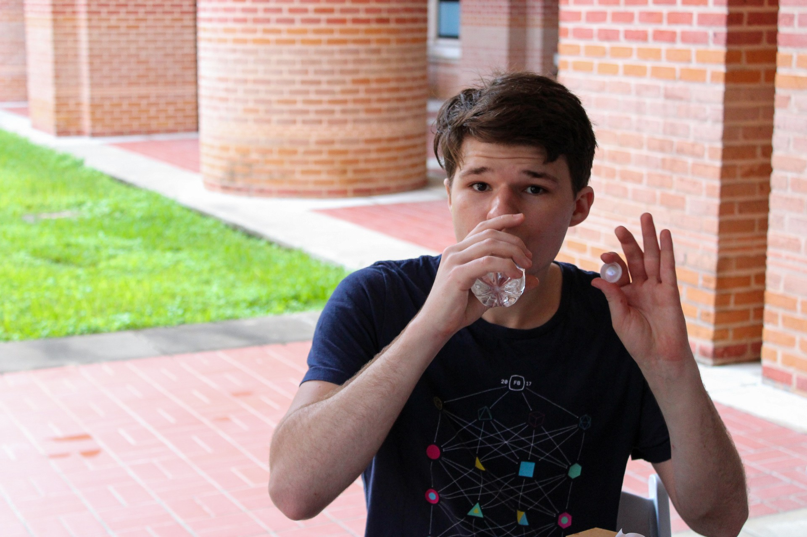

+++
template = "page.html"
title = "About Me"
description = "A little about me."
+++

<figure>

</figure>

Hi! I'm Clayton Ramsey, a Ph.D. student studying computer science at Rice
University.

My research focuses on algorithms for robotics, specifically in planning.
I'm especially interested in applications of hardware acceleration for planning algorithms: how can we use already-existing hardware to get the most out of our computers?
The long-term goal of my work is to develop algorithms for _reactive planning_; that is, ways for robots to replan on the fly as the world changes around them.
Right now, I'm looking at applications in _task and motion planning_: large, complex problems with massive long-horizon constraints.

On the side, I also like to play with high-performance programming, especially for automating games.
I don't have much time for it now, but I'm still interested in chess engines; my own chess engine, [Fiddler](https://github.com/claytonwramsey/fiddler), is open source.
I do a lot of programming in Rust these days, but I also work with C, C++, and Python as needed.
I dabble a little bit in web design and software engineering -- you can see the fruits of that work here.

In my free time, I like to figure skate, dance, and bake.
I've been a figure skater since I was three years old!
I'm not in the competitive skating scene any more, but I still practice and goof off every so often.
Dance-wise, I do a lot of different styles of partner dance: swing, international ballroom, and social Latin are my main genres, and Lindy hop is my favorite overall.
I mostly bake for fun, and I do a lot of desserts.
If I make any custom modifications to a recipe, I publish it on my [recipes page](/recipes).

## Contact

I have deleted most of my social media accounts, but you can still reach me through a few old fashioned ways.

- **Email:**
  [claytonwramsey@gmail.com](mailto:claytonwramsey@gmail.com)
- **GitHub:** [\@claytonwramsey](https://github.com/claytonwramsey)
- **LinkedIn:** <https://www.linkedin.com/in/claytonwramsey> (fair warning, I hardly ever check this one)
- **Google Scholar:**
  <https://scholar.google.com/citations?user=VOYJI5YAAAAJ>
