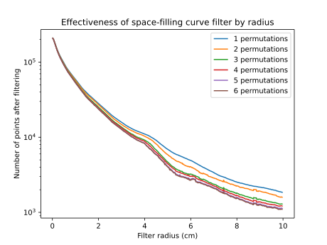

+++
title = "Making robots plan faster with SIMD and Rust"
date = 2024-06-08
description = "Systems programming and data structures meet to make instant collision-checking."
template = "post.html"
authors = ["Clayton Ramsey"]
+++

Systems programming and data structures meet to make instant
collision-checking.

I'm now wrapping up the first "real" research project of my Ph.D.,
which is both exciting and very stressful at the same time. I got to
experiment with a lot of really cool things, but most of them didn't
actually work. I'm writing this blog post as a chance to explain all
the things I tried that didn't work out, as well as to share the untold
story of the paper.

Special thanks to my collaborators at the [Kavraki
Lab](https://kavrakilab.org): [Zak Kingston](https://zkingston.com/),
[Wil Thomason](https://wbthomason.com/), and my advisor [Lydia
Kavraki](https://profiles.rice.edu/faculty/lydia-e-kavraki).

If you want to skip straight to just reading the final paper (which
we'll be presenting at [Robotics: Science and
Systems](https://roboticsconference.org)) check it out on arXiV
[here](https://arxiv.org/abs/2406.02807). Alternately, if you want to
check out the code, take a look at the C++ implementation
[here](https://github.com/kavrakilab/vamp) or the Rust implementation
[here](https://github.com/claytonwramsey/captree).

## The problem at hand

When we talk about <dfn>motion planning</dfn>, we refer to a relatively
simple problem: given a start position and an end position, find a safe,
continuous movement for a robot to move from the start to the end. There
are millions of variations on the problem setup (kinodynamic
constraints! uncertainty! multiple robots! multi-modal actions!
underactuation!) but all them look kind of similar if you squint hard
enough. There are lots of algorithms for planning - optimization-based,
controls-based, sampling-based, learning-based, and so on. In all these
algorithms, especially in sampling-based planning, we need an efficient
collision-checking routine for determining if a robot's state is valid,
since the planning algorithm will perform thousands of collision-checks
for every plan.

A few months ago, Wil and Zak (two postdocs in my lab) published a
[paper](https://arxiv.org/abs/2309.14545v2) demonstrating dramatic
speedups by using SIMD and precompilation for motion planning. However,
their approach assumed that they had access to a primitive
representation of the environment, which is rarely the case in reality.
In many applications, robots must plan using their observed sensor
data - namely, point clouds.

<figure style="display: flex">
<div style="width: 50%">

A Franka Emika Panda robot arm.
</div>
<div style="width: 50%">

A spherical approximation of the robot's geometry.
</div>
</figure>

We can start by assuming that our robot can be modeled as a set of balls
over some distance metric. Using the $L^2$ norm, these balls are
spheres, which meshes conveniently with sphere-hierarchy representations
of robot geometry. This lets us neatly reduce the problem of
collision-checking all kinds of robot geometries into one simple case:
checking whether a some set of spheres collides with a set of points. In
addition to that, we would like to be able to do our collision checking
in parallel at an instruction level to radically improve our
performance.

## Review: $k$-d trees

There's a simple solution to our collision-checking problem using a
[nearest-neighbors](https://en.wikipedia.org/wiki/Nearest_neighbor_search)
data structure. Given a point cloud represented as a set of points $P$,
construct a nearest-neighbor data structure over $P$. Then, whenever we
have to check whether some robot sphere with center $x$ and radius $r$
is in collision, we find the closest point $p$ in $P$ to $x$, and check
whether the distance from $x$ to $p$ is greater than $r$.

The canonical approach to computing nearest-neighbors is a [$k$-d
tree](https://en.wikipedia.org/wiki/K-d_tree) - a class of space
partitioning tree. There are many formulations, but I'll use a
median-partitioning tree in this case.

At each branch of a $k$-d tree, we split the the space into two
sub-volumes, each containing the same number of points, based on the
median value along one dimension. For instance, if we wanted to split
the points ${(2,3),(4,4)}$ along the first dimension, we'd choose a
split value of 3, and if we were splitting along the second dimension,
we'd choose a split of 3.5. For efficiency, we'll have our tree split
first on dimension 0 ($x$), then dimension 1 ($y$), and so on, until
looping back around to dimension 0.

<figure>


</figure>

When querying the nearest neighbor, we first do a quick binary search of
the tree to find a candidate closest point. Next, we perform a
branch-and-bound search of every other subtree, escaping early if the
test point is further from a volume from the candidate-closest point.
I'm staying light on the exact details here, since the point of this
article is not to explain how $k$-d trees work.

These are very nice data structures, but they suffer from two core
issues for our application: first, $k$-d trees have extremely poor cache
locality due to the fact that they jump around everywhere during a
search. Second, this approach is not at all amenable to SIMD
parallelism, which typically requires some amount of branchlessness. How
do we make something which is similarly performant (or better!) without
the same limitations?

## Being stupid faster

We can start by noticing a neat quirk of the first pass on a $k$-d tree:
the first downward pass can be done completely branchlessly and in a
very cache-friendly way. To do so, we'll need to bring out a special
data layout for trees, called an Eytzinger layout. This [Algorithmica
article](https://algorithmica.org/en/eytzinger) gives a beautiful
explanation of it, but I'll try my own hand at an explanation as well.

<figure class="night-invert">


</figure>

In an Eytzinger layout, we implicitly describe the location of each
branch in the tree by its location in a buffer. We store all the tests
in some array (let's call it `tests` for convenience), and for some
branch-point at index $i$, the left child will be at position $2i + 1$,
while the right child will be at position $2i + 2$. If we assume that
the number of points in the tree is a power of 2, and that the tree is
perfectly balanced, we can create an extremely efficient method for the
first pass through the tree. If the number of points is not a power of
two, we can just pad the point cloud with points at $oo$.

```rust
struct ForwardTree {
    /// contains 2^p - 1 tests
    tests: Box<[f32]>,
    /// contains 2^p points
    points: Box<[[f32; 3]]>,
}

/// Return the index representing
/// the cell in the tree containing `point`.
fn first_pass(tests: &[f32], point: &[f32; 3]) -> usize {
    let mut k = 0;
    let mut i = 0;
    while i < tests.len() {
        i = 2 * i + 1 + usize::from(tests[i] < point[k]);
        k = (k + 1) % 3;
    }

    i - tests.len()
}
```

This first pass computes a `usize` identifying which point in `points`
is closest to `point`. Approximation isn't really good enough for
collision checking, but we'll find some other tricks for that later.
For now, we'll notice that it's pretty easy to render this code as a
parallel implementation using the nightly `portable_simd` feature for
Rust.

```rust
use std::simd::{prelude::*, LaneCount, Simd, SupportedLaneCount};

fn first_pass_simd<const L: usize>(
    tests: &[f32],
    points: &[Simd<f32, L>; 3],
) -> Simd<usize, L>
where
    LaneCount<L>: SupportedLaneCount,
{
    let mut k = 0;
    let mut i = Simd::splat(0);
    let nlog2 = tests.len().trailing_ones();
    for _ in 0..nlog2 {
        let tests = Simd::gather_or_default(tests, i);
        let cmp = points[k].simd_ge(tests).to_int().cast();
        let one = Simd::splat(1);
        i = (i << one) + one + (cmp & one);
        k = (k + 1) % 3;
    }

    i - Simd::splat(tests.len())
}
```

The above code does the exact same thing as `first_pass`, but this time
in parallel across a set of `L` different robot spheres. This means we
can get a speedup of up to `L` times on whole-robot collision checks.

Once we've extracted the identifier for our
approximate-nearest-neighbor, we can do a quick test for whether it's
in collision by computing the distance to the center of the query
sphere.

```rust
/// If this returns `true`, a sphere centered at `point`
/// with radius-squared `rsq` collides with a point in `t`.
/// May erroneously return `false`.
fn forward_coll(t: &ForwardTree, point: &[f32; 3], rsq: f32) -> bool {
    let id = first_pass(&t.tests, point);
    point
        .iter()
        .zip(t.points[id])
        .map(|(&x, y)| (x - y).powi(2))
        .sum::<f32>()
        <= rsq
}
```

Of course, we can also do our collision checking in a SIMD parallel
manner; however, the resulting code would be rather verbose and not very
interesting. Since we'll need to throw that code away shortly anyway,
I'll skip ahead to the good part, which is the performance results.

At these scales, a $k$-d tree is the best competitor. Fortunately,
[`kiddo`](https://github.com/sdd/kiddo), one of the fastest $k$-d tree
implementations out there, is easy to install via Cargo. I'll be using
that as a rough baseline for point cloud collision-checking. I found
that the fastest results came from using `within_unsorted` on an
`ImmutableKdTree`, so I'm using that as my baseline.

<figure class="night-invert">

![A 2D line plot titled 'Query performance of collision-checking
structures.' The x-axis is labeled as 'Number of points in cloud,'
ranging from 0 to 60000, and the y-axis is labeled as 'Collision check
time (ns)'. There are three lines: 'k-d tree (kiddo)' in blue,
'forward tree, sequential' in green, and 'forward tree, SIMD' in
green. All the lines grow roughly logarithmically. The blue line starts
at around 60 ns, then grows to 250 ns. The orange line starts at around
20 ns, then grows to 60 ns. The green line starts at around 10 ns then
grows to 20
ns.](forward_vs_kdt_query.svg)

</figure>

We see that this single-pass approach blows a normal $k$-d tree out of
the water, yielding enormous speedups in query time from hundreds of
nanoseconds to only about 10 ns. Sadly, the SIMD addition is only a
modest improvement - this is because gather instructions are very slow
on my laptop's processor. On other machines, there's usually a more
appreciable performance improvement. This comparison also isn't really
fair: `kiddo` is giving us an exact answer to whether we're in
collision, while our forward tree is only returning an approximate
answer.

Not only that, our approximate answer isn't even all that good. To test
this, I collected a real point cloud and measured the distribution of
position error when selecting nearest neighbors.

<figure class="night-invert">


</figure>

Looking from the cumulative distribution function above, we see that
roughly 20% of points have an error of over 10 cm. In the world of
collision checking, that's enormous - any padding conservative enough
to make this forward tree useful would make it impossible for a robot to
find a plan.

## Missing the forest for the trees

My first idea for fixing this error issue was very simple: if one tree
was only right some of the time, we could get the results from multiple
trees and (hopefully) improve our accuracy.

This is not a new idea, per se: random forests are pretty well known in
the ML community. The core concept is this: we make $T$ different trees.
Each tree is randomly different somehow, yielding typically incorrect
errors. We can then take the best result from each tree for a
(hopefully) dramatic improvement in result quality.

```rust
struct RandomTree {
    tests: Box<[f32]>,
    points: Box<[[f32; 3]]>,
    seed: u32,
}
```

For the sake of branchless parallelism, we'll randomize each tree
according to a pseudo-random number generator. Then, when we search
through the tree, we determine the next axis to branch on based on the
outcome from the RNG.

```rust
/// A simple PRNG.
fn xorshift32(x: &mut u32) -> u32 {
    *x ^= *x << 13;
    *x ^= *x >> 17;
    *x ^= *x << 5;
    *x
}

fn first_pass_rand(tests: &[f32], mut x: u32, point: &[f32; 3]) -> usize {
    let mut i = 0;
    while i < tests.len() {
        let k = xorshift32(&mut x) as usize % 3;
        i = 2 * i + 1 + usize::from(tests[i] < point[k]);
    }

    i - tests.len()
}
```

An astute reader might note that this implementation branches on the
same dimension for each depth in each random tree, independent of which
subtree we search. This is intentional: it makes it easier to write a
branchless SIMD implementation of random tree querying. Otherwise, we'd
need a convoluted sequence of shuffles to get every element in the
correct lane, which would chew up the performance.

Young and full of hope, I tried checking the error distribution of the
random forest approach. I constructed a point cloud, randomly generated
a bunch of query points, and tested those points for their distance to
their nearest neighbor in the cloud.

<figure class="night-invert">


</figure>

When testing the error distribution for a forest, the results are less
than impressive. We get diminishing returns at around 4 trees in the
forest, with minimal gains from adding trees past that. Even with 10
trees in the forest, our maximum error could be as much as 20 cm.

<figure class="night-invert">


</figure>

Even if that error distribution were better, queries to these forests
exhibit superlinear scaling with the number of trees, since together
they use so much memory that they can't all fit in the cache. At around
10 trees, the SIMD performance of a forest is about the same as a $k$-d
tree, but as we discussed before, the error isn't good enough to
justify using it.

## A budget for affording

Let's briefly take stock of the situation. Using our forward tree, we
can quickly classify a query point as belonging to a single unit cell.
We know that for any fixed cell and radius of a test-sphere, there is a
fixed set of points in $P$ which are close enough to collide with at
least one point in the cell. If we're targeting a particular robot, we
also know $r_"max"$, the maximum radius of a sphere on the robot.
If we trust that we'll never do a collision check for a sphere larger
than $r_"max"$, then any query point in a given cell can only
ever collide with a fixed set of points in the cloud: namely, the set of
points whose distance to the cell is less than or equal to
$r_"max"$.

<figure class="night-invert">


</figure>

Let's call those points <dfn>afforded</dfn>; that is, for a given cell $c$
and a radius $r$, $c$ affords $p$ if there exists a point $x in C$
such that $|p - x| lt.eq r$.

Using our knowledge of $r_"max"$, we can annotate each leaf of
our forward-tree with the list of all afforded points. Then, when
checking for collision, we can traverse this list of afforded points and
test for collision against any of them. This allows us to convert our
approximate-nearest-neighbor guess into a completely accurate
range-nearest-neighbors query without . I currently call the resulting
structure an <dfn>collision-affording point tree</dfn>, or <dfn>CAPT</dfn> for
short.

Now, instead of storing a single point for each leaf of the tree, we'll
store a list of points which might be in collision, called an
<dfn>affordance set</dfn>.

```rust
struct Capt {
    tests: Box<[f32]>,
    afforded: Box<[Box<[[f32; 3]]>]>,
}
```

However, this data layout isn't quite optimal. We've broken up our
possibly-colliding points into a bunch of different allocations,
requiring an extra size parameter on each and fragmenting our memory. We
can coagulate all the affordance set into one gigantic array, and then
use another lookup table to get the starting and ending indices relevant
to one point.

Additionally, to make SIMD parallelism easier, we can use a
struct-of-arrays layout for each point in `afforded`, which means that
we split out each dimension of every point, and store them in separate
buffers.

```rust
struct Capt {
    /// contains n - 1 elements
    tests: Box<[f32]>,
    /// contains n + 1 elements
    starts: Box<[usize]>,
    /// each buffer contains aff_starts[n] elements
    afforded: [Box<[f32]>; 3],
}
```

Once we have a cell index `id` from `first_pass`,
`afforded[starts[id]..starts[id + 1]]` will contain all the afforded
points for the cell.

```rust
fn capt_collides(t: &Capt, point: &[f32; 3], rsq: f32) -> bool {
    let id = first_pass(&t.tests, point);
    (t.starts[id]..t.starts[id + 1]).any(|i| {
        t.afforded
            .iter()
            .zip(point)
            .map(|(a, &b)| (a[i] - b).powi(2))
            .sum::<f32>()
            <= rsq
    })
}
```

If we tried to parallelize collision-checking between our query spheres
and afforded points like we did in `first_pass`, we wouldn't actually
see much performance benefit. I know this because that's what I had
originally tried, and it was hardly faster than the sequential
implementation. The heart of the problem is that gather instructions are
comically slow on nearly all processors, so the CPU spends far more time
waiting for memory to arrive than it does on churning through
computations.

To fix this, we need to have a way to test for collision without
touching a large about of memory at the same time. The simplest fix is
the best: instead of parallelizing across queries, we parallelize across
afforded points for one query. We iterate sequentially through the query
spheres, but in parallel, we check whether `L` different afforded points
collide with the same sphere. The upside of this is that the data for
these points are stored contiguously, so we waste no time waiting on
gathers.

```rust
fn capt_collides_simd<const L: usize>(
    t: &Capt,
    points: &[Simd<f32, L>; 3],
    radii: Simd<f32, L>,
) -> bool
where
    LaneCount<L>: SupportedLaneCount,
{
    let ids = first_pass_simd(&t.tests, points);

    let start = Simd::gather_or_default(&t.starts, ids);
    let end = Simd::gather_or_default(&t.starts, ids + Simd::splat(1));

    for l in 0..L {
        let pt = [0, 1, 2].map(|k| Simd::splat(points[k][l]));
        let rsq = Simd::splat(radii[l].powi(2));
        for s in (start[l]..end[l]).step_by(L) {
            let mut distsq = Simd::splat(0.0);
            for (pt_k, aff_k) in pt.iter().zip(&t.afforded) {
                // assume `affordances[k]` is sufficiently long
                // for simplicity
                let diff = pt_k - Simd::from_slice(&aff_k[s..]);
                distsq += diff * diff;
            }
            if distsq.simd_le(rsq).any() {
                return true;
            }
        }
    }

    false
}
```

## Squeezing out some juice

The performance of this "default" tree is pretty good, but there's
one place where it suffers a lot: non-colliding queries. If a query
sphere doesn't collide with any afforded point, we have to check every
single afforded point. Some cells could afford hundreds of points, which
would yield extremely poor runtimes. We need some sort of fast-path
rejection for queries which are certainly not in collision.

### Getting in order

I first observed that many query spheres had much smaller radii than the
maximum afforded radius of the tree. This means that many of the
afforded points for each cell would be further from the cell than the
query radius, meaning that they could never collide with a query sphere
of that radius.

<figure>


</figure>

The first idea we had for this was to sort all the points in each
affordance set in descending order of distance to the cell. That way,
searches with small query radii would be able to terminate earlier: as
soon as the collision-check found a point further from the cell than the
query radius, the search could terminate immediately.

This was good for query performance, but came at a significant cost in
tree construction time. I'll explain the details of construction later
in this post, but for now, know that this measure put construction times
into the worst-case regime of $O(n^2 log n)$ for trees containing
$n$ points. This is far too much time when $n$ is measured in thousands;
in some of my tests it took 30 seconds to construct the tree on large
point clouds. In the end, I had to nix this feature for performance.

### Shrinking down

<figure class="night-invert">


</figure>

While experimenting, I found that a very small minority of cells had
extremely large affordance sets. These cells were typically very small,
and in the middle of a big cluster of points. Often, because the cells
were so small, every single query sphere inside the cell would collide
with the representative point of the cell.

I decided to take advantage of this to reduce the peak affordance size.
We already accept that we know $r_"max"$, so why not also provide
a minimum radius $r_"min"$? If a sphere of radius
$r_"min"$ collides with a point, then any other query sphere with
the same center should also collide, no matter what. For the small
cells, then, we can throw away all other points except the
representative point of the cell and store only a single point in its
afforded set.

### Bounding my boxes

<figure class="night-invert">


</figure>

There's one last notable case where the search spends a lot of time
needlessly checking for collisions. Cells near the edge of a cluster are
often long and skinny, with one tip of the cell being very close to the
cluster and the other tip extending far out into space. Those long,
skinny cells often take up the majority of the free space in the
environment, meaning most of our queries will actually be against a cell
which is mostly empty.

We'd like to be able to filter out queries which aren't in collision
as fast as possible, ideally skipping the lengthy affordance set check.
Since often only one part of the cell contains afforded points, this
opens up a possibility for improvement: what if we just didn't check
the spheres in the "empty" part of the cell?

To do this, we construct an axis-aligned bounding box (AABB) containing
the affordance set for each cell. If we're lucky, the AABB will often
be much smaller than its cell.

```rust
struct Capt {
    /// contains n - 1 elements
    tests: Box<[f32]>,
    /// contains n elements
    aabbs: Box<[Aabb]>,
    /// contains n + 1 elements
    starts: Box<[usize]>,
    /// each buffer contains aff_starts[n] elements
    afforded: [Box<[f32]>; 3],
}

#[derive(Clone, Copy)]
struct Aabb {
    lo: [f32; 3],
    hi: [f32; 3],
}
```

Then, when querying, we can cheaply detect whether a query sphere
intersects the AABB. If it doesn't, then we know that the sphere is not
in collision, and can avoid later expensive steps in collision-checking.

```rust
fn intersects(aabb: &Aabb, center: &[f32; 3], rsq: f32) -> bool {
    aabb.lo
        .into_iter()
        .zip(aabb.hi)
        .zip(center)
        .map(|((l, h), x)| |((l, h), x)| (x.clamp(l, h) - x).powi(2))
        .sum::<f32>()
        <= rsq
}

/// Rewritten from the previous version.
fn capt_collides(t: &Capt, point: &[f32; 3], rsq: f32) -> bool {
  let id = first_pass(&t.tests, point);
  intersects(&t.aabbs[id], point, rsq)
      && (t.starts[id]..t.starts[id + 1]).any(|i| {
          t.afforded
              .iter()
              .zip(point)
              .map(|(a, &b)| (a[i] - b).powi(2))
              .sum::<f32>()
              <= rsq
      })
}
```

With that, we have the complete collision-checking logic for a CAPT. The
process is simple: classify a query sphere as belonging to a cell, then
check whether the query sphere collides with any points sufficiently
close to the cell. This step can also be parallelized using SIMD by
batching collision checks with a set of afforded points in a cell;
however, I'm not including the sample code for that since it's quite
complicated.

<figure class="night-invert">


</figure>

To see how well this tree performs, I'm showing the results from a
benchmark above. This plot shows the relative throughput of various
methods on a sequence of collision-checking queries. These queries were
recorded from a real motion planning problem, then I played the same
sequence of queries back with just the collision-checking to see how
much each collision-checking procedure took. All the numbers for the
Rust implementation were recorded on my laptop, though our paper's
benchmarks ran on a somewhat beefier desktop computer.

We see that the CAPT is only slightly slower than the naive forward-only
tree. For some reason, it slows down dramatically once there are enough
points: this only occurs on my laptop, so I suspect it has something to
do with cache locality weirdness.

## Under construction

<figure class="night-invert">


</figure>

<figure>
<div style="display: flex">

<div style="min-width: 50px">

</div>

</div>

<figcaption>This produces two new cells, each with half as many points.
The affordance set is filtered down and then expanded to include points
from the opposite side of the partition.</figcaption>

</figure>

After all this, I still haven't explained how these trees are
constructed. Efficiently constructing a CAPT is nontrivial, since the
brute-force approach to affordance set construction is a total
non-starter. Luckily, the construction procedure is much like that of a
normal $k$-d tree.

We start out given some list of $n$ points $P$, our point cloud. Since
our Eytzinger-layout-based search procedure requires $n$ to be a power
of two, we compute $n'$, which is the next power of two after
$n$, and then pad $P$ to length $n'$ with points at
$mat(oo, oo, oo)$ to produce
$P'$.

Next, we recursively partition the tree, maintaining a candidate
affordance set $z$, initialized as an empty set; and a candidate volume
$c$, initialized to the axis-aligned bounding box containing all of
$RR^3$. We partition $P'$ by the following steps:

1.  Compute the median plane for the current cell.
2.  Split the cell by the median plane into two smaller cells, $c_{1}$
    and $c_2$. Split the points in the cell into two subsets: those
    below the median plane and those above the median plane; call them
    $P_1$ and $P_2$.
3.  Construct new affordance sets $z_1$ and $z_2$, such that
    $z_1 = z union P_2$ and $z_{2} = z union P_1$.
4.  Filter out all points in $z_1$ which are not afforded by $c_1$
    at radius $r_"max"$. Do the same for $z_2$ and $c_1$.
5.  Recursively repeat this process for both partitioned cells until
    each cell contains only one point.

I'm intentionally avoiding code in my description here because the code
required to construct the tree is quite verbose. I've made a
stripped-down version in the spoiler block below for completeness,
though.

<details>
<summary>*deep breath*</summary>

First, a helper function for determining whether a sphere contains all
of a cell:

```rust
fn sphere_contains(center: &[f32; 3], rsq: f32, vol: &Aabb) -> bool {
    vol.lo
        .into_iter()
        .zip(vol.hi)
        .zip(center)
        .map(|((l, h), c)| if c - l < h - c { h - c } else { c - l }.powi(2))
        .sum::<f32>()
        <= rsq
}
```

We start by padding the points to a power of two, then immediately call
out to a helper function to populate all the buffers.

```rust
fn capt_new(points: &[[f32; 3]], r_range: (f32, f32)) -> Capt {
    let n2 = points.len().next_power_of_two();
    let mut points2: Vec<_> = vec![[f32::INFINITY; 3]; n2];
    points2[..points.len()].copy_from_slice(points);
    let mut tests = vec![f32::NAN; n2 - 1].into_boxed_slice();
    let mut afforded = [Vec::new(), Vec::new(), Vec::new()];
    let mut starts = vec![0];
    let mut aabbs = Vec::new();

    capt_new_help(
        &mut points2,
        &mut tests,
        &mut aabbs,
        &mut afforded,
        &mut starts,
        0,
        0,
        r_range,
        Vec::new(),
        Aabb {
            lo: [f32::NEG_INFINITY; 3],
            hi: [f32::INFINITY; 3],
        },
    );

    Capt {
        tests,
        aabbs: aabbs.into_boxed_slice(),
        starts: starts.into_boxed_slice(),
        afforded: afforded.map(Vec::into_boxed_slice),
    }
}
```

Next, we write the main recursive helper function for splitting up cells
and populating the affordance sets. If this looks convoluted, remember
that the version used in the final code was even worse.

```rust
#[allow(clippy::too_many_arguments)]
fn capt_new_help(
    points: &mut [[f32; 3]],
    tests: &mut [f32],
    aabbs: &mut Vec<Aabb>,
    afforded: &mut [Vec<f32>; 3],
    starts: &mut Vec<usize>,
    k: usize,
    i: usize,
    r_range: (f32, f32),
    in_range: Vec<[f32; 3]>,
    cell: Aabb,
) {
    // Base case: only one point in the cell means this is a leaf
    if let [rep] = *points {
        // AABB of all afforded points
        let mut aabb = Aabb { lo: rep, hi: rep };

        // Exclude padded infinites from affordance sets
        if rep[0].is_finite() {
            // Representative point comes first
            (0..3).for_each(|k| afforded[k].push(rep[k]));
            // Don't include other points if the cell is small enough
            if !sphere_contains(&rep, r_range.0.powi(2), &cell) {
                for p in in_range {
                    for k in 0..3 {
                        // Expand AABB to contain afforded points
                        if p[k] < aabb.lo[k] {
                            aabb.lo[k] = p[k];
                        } else if aabb.hi[k] < p[k] {
                            aabb.hi[k] = p[k];
                        }
                        afforded[k].push(p[k]);
                    }
                }
            }
        }
        // Update starts to match this region of afforded
        starts.push(afforded[0].len());
        aabbs.push(aabb);
        return;
    }

    // Recursive case: splitting a cell

    // Compute the median plane of the cell
    let (lh, med_hi, _) = points
        .select_nth_unstable_by(points.len() / 2, |a, b| {
            a[k].partial_cmp(&b[k]).unwrap()
        });
    let med_lo = lh
        .iter()
        .max_by(|a, b| a[k].partial_cmp(&b[k]).unwrap())
        .unwrap();
    let test = (med_lo[k] + med_hi[k]) / 2.0;
    tests[i] = test;

    // Split the volumes
    let mut lo_range = in_range.clone();
    let mut hi_range = in_range;

    let mut lo_vol = cell;
    lo_vol.hi[k] = test;
    let mut hi_vol = cell;
    hi_vol.lo[k] = test;

    // Compute the new afforded sets
    lo_range.retain(|p| intersects(&lo_vol, p, r_range.1.powi(2)));
    hi_range.retain(|p| intersects(&hi_vol, p, r_range.1.powi(2)));

    let (lhs, rhs) = points.split_at_mut(points.len() / 2);
    lo_range.extend(rhs.iter().filter(|p| p[k] <= test + r_range.1));
    hi_range.extend(lhs.iter().filter(|p| p[k] >= test - r_range.1));

    // Recur for each half of the split
    capt_new_help(
        lhs,
        tests,
        aabbs,
        afforded,
        starts,
        (k + 1) % 3,
        2 * i + 1,
        r_range,
        lo_range,
        lo_vol,
    );

    capt_new_help(
        rhs,
        tests,
        aabbs,
        afforded,
        starts,
        (k + 1) % 3,
        2 * i + 2,
        r_range,
        hi_range,
        hi_vol,
    );
}
```

</details>

<figure class="night-invert">


</figure>

Unfortunately, even with some extra engineering work, our construction
times for the tree still sucked. I even tried transforming the recursive
construction procedure into a stack-based iterative one. At the end of
the day, the core problem is simply algorithmic: if the average
affordance-set size is $a$, and there are $n$ points, construction takes
roughly $O(k n a)$ time for sufficiently large $a$. In most cases, $a$
grows with $n$, so it could perform as slowly as $O(k n^2)$ in some
clouds. For a cloud with a few hundred thousand points, that's
completely untenable.

## Filter feeders

The most natural solution to our construction time problem is to reduce
the size of our point clouds. There are many ways to do this, and the
simplest way is to just uniformly randomly sample points from the cloud
until we have the desired quantity. However, most methods provide few
guarantees about the quality of the sampled cloud. Ideally, we want to
downsample the cloud to reduce its density as much as possible; however,
we can't downsample so much that we hallucinate a gap in the cloud and
produce an invalid plan. Accordingly, we'll need a more intelligent
filtering scheme.

While we were thinking about filtering point clouds, we were also
thinking about efficient construction algorithms for the tree. One idea
we had played with was implicit representation for afforded sets. The
hope was that we could store less data while constructing the tree and
filter out affordance sets in $O(1)$ time. One such approach used
segments of a space-filling curve to represent sets of points, which
would hopefully have allowed us to slice up affordance sets much more
efficiently.

Unfortunately for us, that approach never worked out, and so we were
stuck with our bad construction times. However, we still had the idea of
space-filling curves on our mind when we were thinking about filtering
the point cloud. How could we use a space filling curve to filter out
point clouds more efficiently?

I'll start with a simple example. Suppose we have a list of points in
one-dimensional space; that is, a list of real numbers, and we want to
filter it to reduce its density, but still preserve the areas where
points are in collision. In particular, we might want to make sure that
if some point $p$ is removed, there exists another point $p^*$ which
was _not_ removed, such that $|p^* - p|$ is less than some radius
$r_"filter"$. In that case, filtering our list of points would be
easy: we sort the points in order, then remove one of every adjacent
pair $(p,q)$ if $|p - q| lt.eq r_"filter"$.

With a bit of cleverness, we can generalize this approach to arbitrarily
many dimensions. The trick is to instead sort the points along a
space-filling curve, which will place nearby points approximately near
each other when sorted.

<figure>


<figcaption>Points on a 2D plane, colored by their position along a Morton
curve.</figcaption>

</figure>

The best-known space-filling curve is the [Hilbert
curve](https://en.wikipedia.org/wiki/Hilbert_curve), but it's
relatively convoluted to compute. Instead, we used a [Morton
curve](https://en.wikipedia.org/wiki/Z-order_curve) (also known as a
Z-order curve), because it's trivial to compute a point's position
along a Morton curve using a parallel-bits deposit instruction.

```rust
use bitintr::Pdep;
use std::ops::BitOr;

/// Compute `p`'s position along the Morton curve filling `aabb`.
fn morton_index(p: &[f32; 3], aabb: &Aabb) -> u32 {
    const MASK: u32 = 0b001_001_001_001_001_001_001_001_001_001;

    // the magic 1024 comes from the fact that MASK has 10 bits set,
    // so we scale up the position of `p` along each axis to have 10 bits
    // per dimension.
    p.iter()
        .enumerate()
        .map(|(k, x)| {
            (((x - aabb.lo[k]) * 1024.0 / (aabb.hi[k] - aabb.lo[k])) as u32)
                .pdep(MASK << k)
        })
        .fold(0, BitOr::bitor)
}
```

The main downside to using the space-filling curve filter is that there
are "cliffs" - regions where moving a small amount in space
dramatically changes your position on the space-filling curve. To fix
this, we can just filter the point cloud multiple times. Each time,
we'll use a different Morton curve (one for each permutation of
dimensions) in the hopes that using different filters will give us more
opportunities to filter points.

<figure class = "night-invert">



</figure>

In practice, this yields some pretty great results! One filter pass can
dramatically reduce the size of a point cloud, even at a small radius.
In the plot above, I've run up to 6 different filters over a point
cloud of a bookshelf containing $2^16$ points. Looking at the plot
above, we get some diminishing returns from filtering with more
permutations. However, since the construction performance is so
superlinear, it's still worthwhile to do some extra filtering in the
hopes of reducing point cloud size a little further.

We also played around a little bit with scaling dimensions of the Morton
filter. We started by stretching and transforming the space such that
the region $[0, 2^32)$ gets mapped to the AABB containing all
the points in the point cloud. Since the filter removes some points on
the edge of that AABB, we tried shrinking the AABB to fit the new
sparsified point cloud for the next iteration of the filter, and we also
tried leaving it as-is. For reasons I can neither explain nor
comprehend, the most effective way was to take an average of the two
AABBs to produce the best filtering results.

## Into the C++ mines

I hate C++. This isn't a place for unhinged ranting about programming
languages, but let it be known that I do not write C++ willingly or
lightly. However, the vector-accelerated motion planner that I was
developing for was written in C++, and there's no shot of it getting
rewritten in the near future. We all have better things to do. Instead,
I got to reimplement all the Rust prototype code in C++.

On the whole, it wasn't as bad as it could have been, but a small part
of me dies inside every time I have to read a template instantiation
error message. My Rust implementation (not the simplified version in
this blog post) was polymorphic over dimension, but I only had to
implement the C++ version for $k = 3$, which made things easier.

We spent a little more engineering effort on construction and query
times for the C++ code, in part by taking advantage of some
domain-specific knowledge. This let us eke out a little more
performance, so the Rust code is marginally slower, but not due to any
differences in programming languages.

I spent a lot of time debugging quirky results. For reasons I still have
yet to understand, the SIMD queries performed _worse_ on SIMD-parallel
queries than they did on sequential queries. However, this result
exclusively ocurred on the C++ implementation on my laptop - no other
machines. The solution? Simply run the benchmarks on a different
machine.

## The final scramble

<figure class="night-invert">


<figcaption>Collision-checking throughput performance in the C++
implementation.</figcaption>

</figure>

What I've described so far was roughly the state of the project around
two weeks before the submission deadline. However, it takes more than a
good idea to produce a good paper. We needed serious benchmarks against
serious competitors. Since the state of C++ software packaging is
practically nonexistent, this typically entailed vendoring the source
code as a Git submodule, patching it into the CMake build system, and
praying that it would compile. Repeat for each competitor and we've got
a full set of benchmarks.

We really cared about a few main competitors:
[OctoMaps](https://octomap.github.io/) and $k$-d trees (in the C++
implementation [nanoflann](https://github.com/jlblancoc/nanoflann) and
[Nigh](https://github.com/UNC-Robotics/nigh)). OctoMaps are a big deal
in the planning world, and tend to be the most common off-the-shelf
environment representation for point clouds, while comparing against
$k$-d trees would prove that our SIMD and cache-efficiency efforts
actually did something. We benchmarked against a handful of others, but
this blog post is far too long for me to go into detail about all of
them.

<figure>
<table>
<thead>
<tr class="header">
<th scope="col">Collision-Checker</th>
<th scope="col">Filter</th>
<th scope="col">Build</th>
<th scope="col">Plan</th>
<th scope="col">Simplification</th>
<th scope="col">Total</th>
</tr>
</thead>
<tbody>
<tr class="odd">
<td>OctoMap</td>
<td rowspan="3">2.9</td>
<td>120.9</td>
<td>78.9</td>
<td>23.3</td>
<td>220.9</td>
</tr>
<tr class="even">
<td>nanoflann</td>
<td>0.3</td>
<td>15.5</td>
<td>7.8</td>
<td>26.7</td>
</tr>
<tr class="odd">
<td>CAPT</td>
<td>5.9</td>
<td>0.5</td>
<td>0.2</td>
<td><strong>9.5</strong></td>
</tr>
</tbody>
</table>
<figcaption>Mean simulated planning times for the UR-5 robot in
milliseconds. For details, refer to the <a
href="https://arxiv.org/abs/2406.02807">paper</a>,</figcaption>
</figure>

When hooked up to a full motion planner, we found that we could get
speedups by multiple orders of magnitude. Planning times fell from the
order of tens to hundreds of milliseconds using an OctoMap down to
**microseconds** with our data structure. From end to end, we could go
from a raw point cloud all the way to a completed plan in **under
sixteen milliseconds**. That means that sixty-hertz online planning
times are possible!

For the final benchmarks, instead of using my laptop, we used a much
beefier computer with a Ryzen 9 7950X, which accounts for the biggest
difference in empirical performance compared to the earlier plots. We
were actually quite surprised by our results - we weren't expecting to
be that far ahead.

Our target conference was [Robotics: Science and
Systems](https://roboticsconference.org), which is a relatively small
yet competitive venue. Typically, they have high standards for
submission quality, so we were worried about about making the cut,
especially on a tight deadline. We ended up divvying up the work for the
paper: I was mostly responsible for writing up the method, related work,
some analysis, and results, while my collaborators Wil and Zak wrote up
the intro and added their own parts to the stuff that I had drafted.
Lastly, my advisor, Lydia, reviewed and edited the paper.

We wanted to benchmark against
[nvblox](git@github.com:nvidia-isaac/nvblox.git), but it was a nightmare
to get it to compile and run on anything. I managed to obliterate my
graphics drivers twice while setting up the requisite CUDA drivers, and
had to reinstall the OS from scratch. In the end, we just gave up.

### Software hell

<figure>


<figcaption>
A point cloud of a table in our lab. It took painfully long to get this
image and one paragraph in our paper.
</figcaption>
</figure>

We also tried to get the planning system running on a real robot. The
first hurdle was exfiltrating a point cloud from the RealSense camera,
which proved surprisingly difficult, mostly because I believe that
software was invented as some sort of cruel punishment for my sins. We
only managed to get the imaging stack working late around 3 A.M. on the
night the paper was due. In my experience, my productivity drops off
dramatically around 10 P.M., so perhaps that was only two hours of
"real" work, but it was still far more difficult than getting a list
of points in the correct coordinate frame should be. Armed with our
point cloud, we were able to get real-enough demo results for the paper.

## Victory laps

Like many other venues, RSS has two different submission deadlines: the
paper deadline and then the supplemental materials submission a week
later. This meant that we had enough time to try to get an online
planner running, hopefully to demonstrate camera-frequency planning.
However, we ran up against a new problem: we were planning _too fast_.

The heart of the issue was ROS's trajectory blender: by and large, it
assumes new trajectories are provided only once every few seconds.
However, our planner could produce hundreds of plans per second with
ease: at that frequency, the trajectory blender could not keep up and so
it yielded inconsistent, jerky motions.

We didn't have time to fully fix the issue before the submission
deadline, but a few days later we managed to finally get things running.
Our solution was to instead manually implement a velocity controller for
the robot and dodge the ROS interface entirely.

<figure>
<iframe src="https://www.youtube-nocookie.com/embed/BzDKdrU1VpM?si=zLtS67SWgnHkLypt" title="YouTube video player" frameborder="0" allow="encrypted-media; picture-in-picture; web-share" allowfullscreen></iframe>
</figure>

Eventually, we got the whole thing running! In the demo video above, the
robot attempts to move to a sequence of preset positions. At every
single camera frame, we scan a point cloud, build an environment, and
then compute an entirely new plan from scratch - roughly sixty times per
second. This means that we can insert arbitrary obstacles in the scene
and it all "just works": the robot magically dodges them all.

We had to do a few hacks to get this to all work, though. The big issues
weren't actually from our planner performance but rather from
perception: occlusion from solids meant that we could only perceive the
surface of obstacles, so we had to pad the radii of all points by 4cm
just to make it so that the robot wouldn't crash into the underside of
the pool noodles. Additionally, if we ever stuck a pool noodle under the
robot, the robot would occlude those points and then happily drive
itself through it.

## Reviewer 2 is real

About a month after we submitted the paper, we got reviews back. Most of
the remarks were things we already knew, but there was one major
hiccup - our proof of correctness. From our filtering method, we knew
that if any point $p$ was removed from a point cloud, we would leave a
point $p'$ such that
$| p - p'| lt.eq r_"filter"$. From that, we derived a
proof that this filter wouldn't produce gaps (based on the dispersion
of the point cloud), and from there on we proved that the whole pipeline
was correct. However, we didn't explain which definition of dispersion
we were using, and so there were maybe ten people on the planet who
would have had a chance at understanding what we claimed at all.

The reviewers rightfully called us out on such nonsense, and thankfully,
there is a definition of dispersion which does make this proof work (see
LaValle, Planning Algorithms, sec. 5.2.3), so we got away with it in the
end.

## Becoming a marketer

> I think you shoulg go to Japan
>
> <footer>Email subject from my advisor, sent at 12:01 AM [sic]</footer>

Very little of an academic's time is spent doing worthy research;
instead, they mostly try to convince others that their research is worth
doing. For the entirety of April and May, my efforts have been mostly
directed that way: preparing materials and advertising my work.

<figure>


<figcaption>Me, presenting my poster at TEROS.</figcaption>

</figure>

I started out small with a poster presentation at
[TEROS](https://teros-texas.github.io/), a small symposium at Texas A&M.
When I printed the poster, however, I picked the wrong version: I
printed a PDF with feedback attached as comments. I only found out that
my poster was covered in yellow highlights when I arrived. It was too
late to fix, so I just didn't mention the highlighting to anyone else.
In spite of this, I had a pretty fun time there, and it seems like there
were a handful of people interested in the work.

At my university, first-year Ph.D. students are given a \$2500 grant for
either conference travel or a laptop to be spent in their first year. By
March, I hadn't spent any of that grant money, since my current laptop
was still working correctly. Accordingly, I got the above email header
from my advisor, Lydia - [ICRA 2024](https://2024.ieee-icra.org/) was in
Yokohama, Japan this year, and I showed up at a workshop with a
trimmed-down version of my paper.

<figure style="display: flex">
<div style="width: 47.5%">

The conference venue at ICRA.
</div>
<div style="width: 5%">

</div>
<div style="width: 47.5%">

I promise I own more than one shirt.
</div>
</figure>

ICRA was my first conference, and I thought it was pretty cool! I got to
see a lot of really exciting work from across the field, and it seems
like a number of people were also excited about my work. To be
completely honest, I also found that the oral presentations were simply
not worth it - it's too easy to zone out, and it's never at the right
amount of detail. Instead, the best place to hang out is in the poster
presentation area, because you can talk directly to the authors and get
a much better sense of their work.

The last major bit of marketing was of course this blog post; though, to
be honest, it's more for my personal pleasure than it is to try to drum
up interest.

## Terminus

The last few months of my degree has been a lot of work, but also a lot
of fun! I originally hadn't believed that I could get all this done in
such a short time. I'll admit, I've sort of impostor-syndromed myself:
my advisor, Lydia, was very impressed with my work, but it feels to me
that my collaborators, Wil and Zak, did a lot of the "real" work. Now
expectations are higher, and I have to figure out how to make something
this good _again_.

That being said, I'm still pretty excited for the future! I think this
is a good first step for my research, and it's opened up a lot of
avenues for me. There are a lot of applications for fast planning out
there, and I'm thinking that I can explore a few to get a full thesis.
