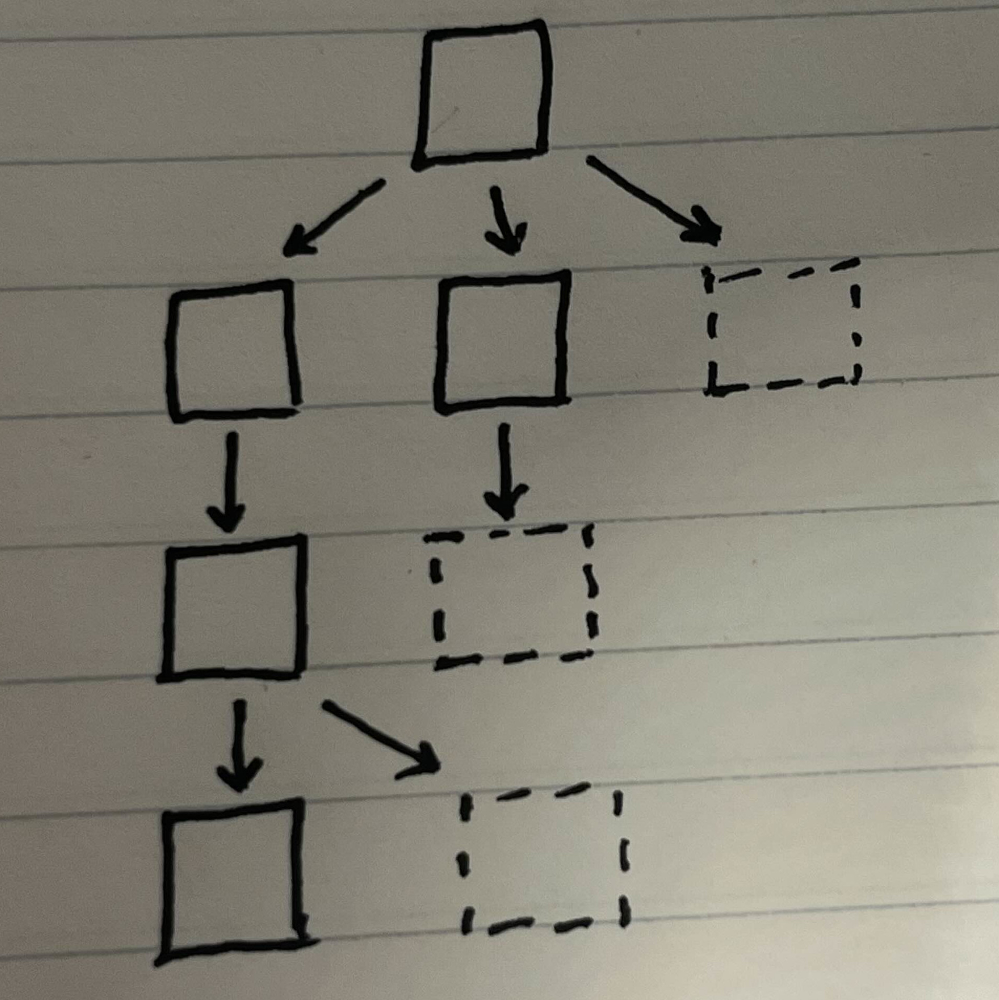
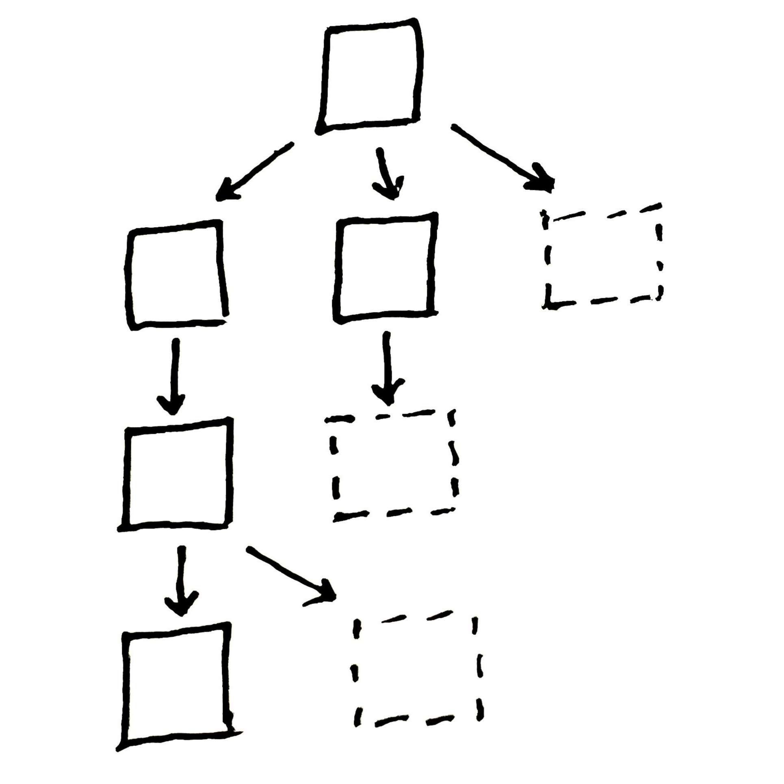
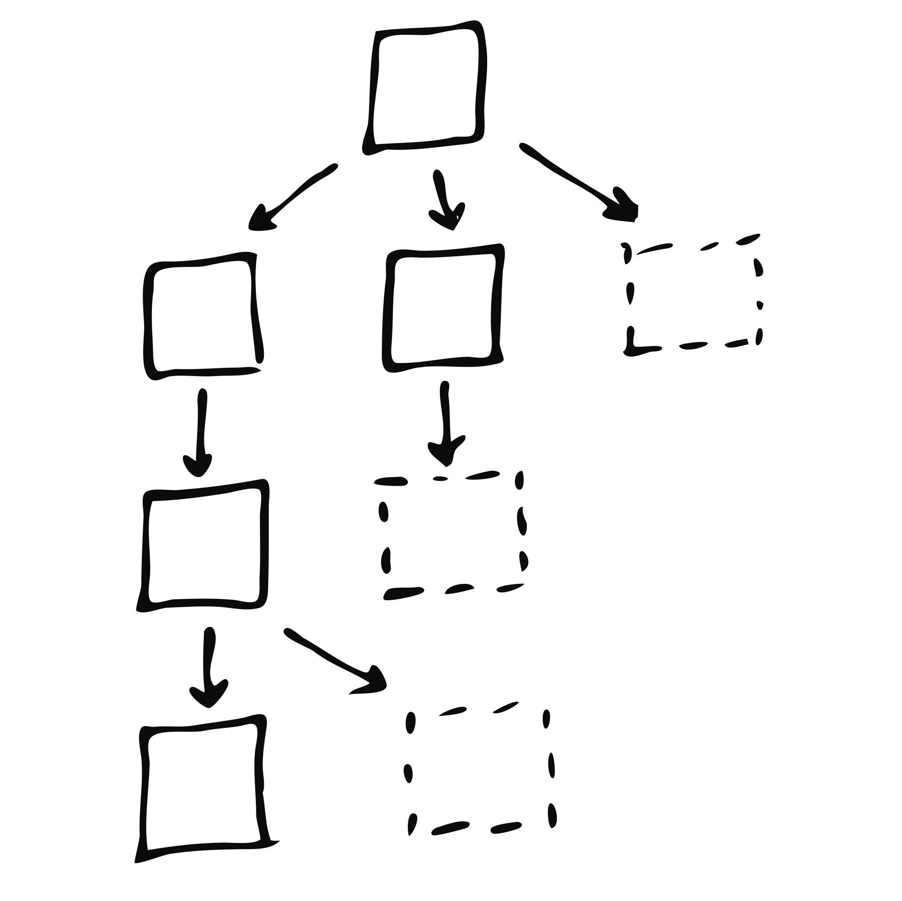

+++
title = "How I make figures"
date = 2025-05-02
description = ""
template = "post.html"
authors = ["Clayton Ramsey"]
+++

As a grad student, I have to give a lot of presentations, and all those presentations have to look good.
Inevitably this means that I have to make a lot of pictures.
This is a short little post about how I make "explanatory" figures: diagrams and models and such.

I prefer to make my own figures, since I'm always disappointed to see AI-generated stock photos.
To be honest, I'd rather they just tell me what prompt they gave to the model, rather than the output.
In some presentations I might also borrow figures from others' work (with attribution, of course), but most of the time, I just make my own.
For this article, I'll walk through the creation process for one figure.
The details aren't super important, but in this case it's a search tree, a la Monte Carlo Tree Search.

## Sketches

<figure >
  <div style="display: flex">
    <div style="width: 50%"></div>
    <div style="width: 50%"></div>
    </div>
  <figcaption>Hand-sketched figures, before and after touching them up.</figcaption>
</figure>

My figures usually start life as sketches done in pen in a notebook.
If I can find one, I'll use graph paper to make things line up nicely on a grid.
Usually, I don't have it, so I just draw it on ordinary college-ruled stuff.

I then take a picture of the sketch with my phone, and fiddle with my phone's built-in color adjustment until it's all just black and white.
Sometimes this is the end state of my figure, since I often don't need perfectly gorgeous slides, and I quite like the scrappy look of the doodles.

<figure>
  
  <figcaption>The diagram after tracing.</figcaption>
</figure>

If I want something just a little bit sharper than the scanned drawing, but still a little scrappy, I'll throw the scanned drawing into Inkscape and have it trace the figure.
This gives cleaner lines and yields scalable figures, but sometimes it smudges things up.

## Nicer figures

<figure>

<div style="display: flex">
<div style="width: 45%">
<!-- make width 100% for this figure -->
<style>
.typst-display {
  width: 100% !important;
}
</style>

```typ
#import "@preview/fletcher:0.5.2" as fletcher: *

#set page(margin: 1pt)

#let dash = (thickness: 2pt, dash: "dotted")
#diagram(
  spacing: (10mm, 0mm),
  cell-size: (0mm, 10mm),
  node-stroke: 2pt,
  edge-stroke: 1.3pt,
  node((0, 0), shape: rect, width: 10mm, height: 10mm, fill: rgb("bfcdd0")),
  node((-1, 2), shape: rect, width: 10mm, height: 10mm, fill: rgb("bfcdd0")),
  node((0, 2), shape: rect, width: 10mm, height: 10mm, fill: rgb("bfcdd0")),
  node((1, 2), shape: rect, stroke: dash, width: 10mm, height: 10mm),

  edge((0, 0), (-1, 2), "-|>"),
  edge((0, 0), (0, 2), "-|>"),
  edge((0, 0), (1, 2), "-|>"),

  node((-1, 4), shape: rect, width: 10mm, height: 10mm, fill: rgb("bfcdd0")),
  node((0, 4), shape: rect, stroke: dash, width: 10mm, height: 10mm),

  edge((-1, 2), (-1, 4), "-|>"),
  edge((0, 2), (0, 4), "-|>"),

  node((-1, 6), shape: rect, width: 10mm, height: 10mm, fill: rgb("bfcdd0")),
  node((0, 6), shape: rect, stroke: dash, width: 10mm, height: 10mm),

  edge((-1, 4), (-1, 6), "-|>"),
  edge((-1, 4), (0, 6), "-|>"),
)
```

</div>
<div style="width: 10%"></div>
<div style="width: 45%">


</div>
</div>

<figcaption>The diagrams, prepared in Typst (left) and Inkscape (right).</figcaption>

</figure>

If I have to produce something official-looking, I usually have two approaches: making the document in Inkscape or generating it in Typst.
This part is usually pretty easy, but it's a little boring, since most of the creative part is done.
I often end up doing a lot of yak shaving instead of making the final versions of these figures.

Both tools are flawed in their own special ways.
Although Typst (in this instance, using [Fletcher](https://typst.app/universe/package/fletcher/)) is much more ergonomic than TikZ, it's still text-based figure generation and suffers from all the same hackiness.
Meanwhile, Inkscape is clunky, and it's hard to get good, consistent-looking drawings even when using a grid.
