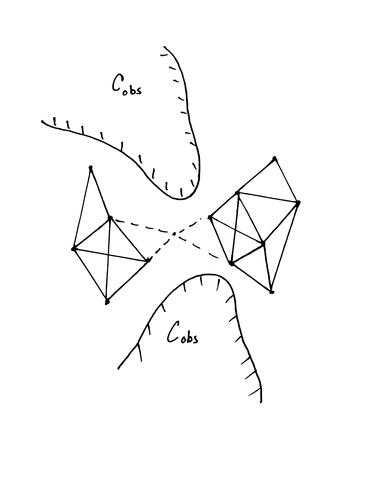

+++
title = "How I make figures"
date = 2025-04-10
description = ""
template = "post.html"
authors = ["Clayton Ramsey"]
+++

As a grad student, I have to give a lot of presentations, and all those presentations have to look good.
Inevitably this means that I have to make a lot of pictures.
This is a short little post about how I make "explanatory" figures: diagrams and models and such.

I prefer to make my own figures, since I'm always disappointed to see AI-generated stock photos.
I think it's much nicer to borrow some other project's pictures (with attribution, of course) but it's hard to rely on other people to make all your pictures for you.

## Sketches

<figure>
  
</figure>

## Nicer figures
