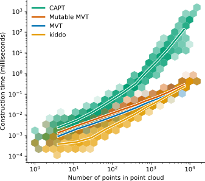
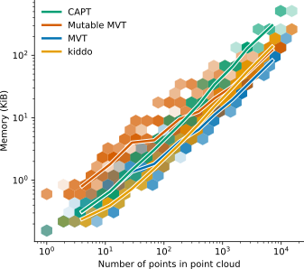
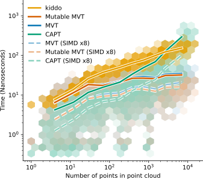
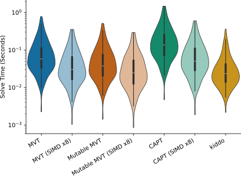

+++
title = "We're not done with point clouds"
date = 2026-07-14
description = ""
template = "post.html"
authors = ["Clayton Ramsey"]
draft = true
+++

## Recapt

Summarize [CAPT](/blog/captree).

- _k_-d tree approach
- leaf cells and affordances
- SIMD queries

## Thinking inside the box

- Idea: design the cells to be good instead of bad
- Then take advantage of sparsity

## Patching some flat tiers

Implementation details of the Rust approach.

- Store everything in one big buffer
- Split out mutability
- Go generic over indices, float types, dimension

## Going sphere for sphere

<figure class="night-invert">

<figcaption>Construction time scaling for each data structure.</figcaption>

</figure>

<figure class="night-invert">

<figcaption>Memory consumption scaling for each data structure.</figcaption>

</figure>

<figure class="night-invert">

<figcaption>Collision-checking throughput scaling for each data structure, including the SIMD-parallel batch queries.</figcaption>

</figure>

<figure class="night-invert">

<figcaption>End-to-end motion planning performance distribution on the Baxter robot.</figcaption>

</figure>

Benchmarking results.
TODO: use final charts from execution on longinus

- Throughput on motion planning problems
- Actual motion planning performance

##
