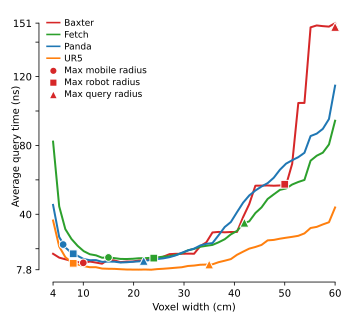
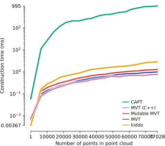
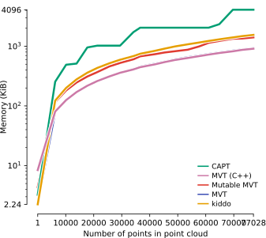
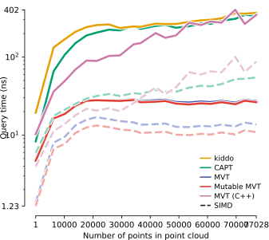
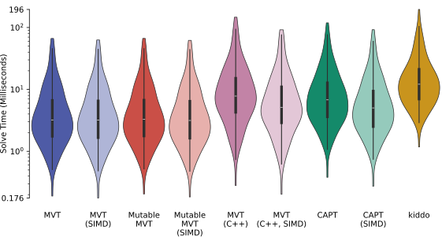

+++
title = "We're not done with point clouds"
date = 2026-07-14
description = ""
template = "post.html"
authors = ["Clayton Ramsey"]
draft = true
+++

## Recapt

I spend a lot of my time thinking about _motion planning_: finding ways for robots to find collision-free motions from a start state to a goal state.
There are a million different ways to solve motion planning problems, but once you've read enough papers they all kind of look the same.
You sample some configurations, test if they're valid, and try to do a big path search over all possible configurations.
Every one of those algorithms requires _configuration validation_: given a robot's configuration $q$, determine whether a robot in position $q$ collides with the world geometry.
Since robots often work in perceived environments, that world geometry typically comes to us as a point cloud.
If our robot's geometry is simplified to a bunch of spheres, we can further simplify the problem to spherical collision checking: for any configuration, just check if any of the spheres on the robot collide with the perceived point cloud.

> **Problem statement:**
> Given some list of $n$ points $P$ and a set of spheres $S$, determine whether any sphere in $S$ collides with $P$ in minimal time.

A few years ago, I proposed a data structure called the [CAPT](/blog/captree), which is designed to make configuration validation against point clouds really fast.
In short, it's a collision-checker between spheres and point clouds.
It's a nearest-neighbor search structure, much like a $k$-d tree, but we do extra work at construction time to avoid backtracking through the search tree.
The net result is that we have a $k$-d tree with a batch-parallel search algorithm, supporting SIMD-accelerated branchless queries.

The big problem with CAPTs was the construction time: dense point clouds require a lot of duplicated data to avoid backtracking.
Once point clouds get dense enough, CAPT construction scales at $O(n^2)$, which is disastrous for a user's hopes of getting planning at control-loop frequencies.
As a workaround, I had to implement a new point cloud filtering method to get the clouds to be sparse enough to keep construction times under control.

## Thinking inside the box

- Idea: design the cells to be good instead of bad
- Then take advantage of sparsity

## Patching some flat tiers

Implementation details of the Rust approach.

- Store everything in one big buffer
- Split out mutability
- Go generic over indices, float types, dimension

### Big balls, big problems

In order to build an MVT, you need to pick how big your voxels have to be.
If voxels are too big, then collision-checking queries will waste too much time searching through far-away points, but if they're too close, then queries will instead have to cull against dozens of tiny voxels.

There are a few plausible candidates, however.
On each robot's spherized geometry, we can pick out the biggest sphere of the robot, whose radius is $r_"max"$.
Alternately, we could restrict ourselves to just the moving links of the robot, skipping the big spheres on most robots' base links, yielding $r_"mobile"$.
Lastly, we could take a look at the robot's bounding-volume hierarchy, and then pick out $r_"query"$, the size of the largest sphere ever used in a collision-check.

<figure class="night-invert">

<figcaption>

Scaling of query speed with voxel width.
Each curve shows the average query time for an MVT generated with the voxel width on the X axis, separated by robot.
$r_"mobile"$, $r_"robot"$, and $r_"query"$ are all shown marked as ●, ■, and ▲ respectively.

</figcaption>

</figure>

The original MVT paper recommended using $r_"max"$, largely just by waving generally at query times and claiming that performance was good enough with that selection.
However, I wanted to get a better answer than that, so I decided to be empirical.
For a simulated workload on every robot, I ran a parameter sweep over the voxel width and recorded the average collision-checking time
I then rendered the collision checking performance in the plot shown above.

For Fetch, Panda, and UR5, $r_"max"$ is indeed a respectable choice of voxel width, but not totally optimal.
However, for the Baxter robot, I found that using $r_"max"$ as the voxel width is exceedingly slow, yielding query times twenty times slower than with an optimal selection.
I suspect the orignal MVT authors never benchmarked against Baxter, or they would have found this, but in any event I will take my free speedup and carry on.

Surprisingly enough, the optimal voxel width for all robots always lands roughly between 10 and 20 cm.
I suspect this is a consequence of the point cloud filtering process: for a given point cloud density, there is a roughly optimal voxel size to minimize the amount of wasted work.

## Going sphere for sphere

Naturally, you have to actually benchmark your code to tell if it's fast.
To do so, I whipped together a few fun benchmarks: I solved a bunch of motion planning problems, recorded all of the collision checks that the planners made, and then replayed those collision checks to just time the collision checking throughput.
For each problem, I recorded the data structure construction and collision checking time across all the data structures I considered: the MVT implementations, my old CAPT implementation, and `kiddo`, a $k$-d tree.

<figure class="night-invert">

<figcaption>Construction time scaling for each data structure.
  Each line shows average performance of a data structure for a bucket of point clouds.</figcaption>

</figure>

The most obvious win comes from construction time.
CAPTs were always slow to build, and they were especially slow in the Rust implementation.
In fact, when I benchmarked my end-to-end planning pipelines, CAPT construction was always the slowest step.
Since MVTs don't do nearly as much bookkeeping at construction time, they get a big performance win.
Also, since the MVT has linear memory scaling, its construction time is on the order of $O(n)$ with point cloud size $n$, instead of $O(k n log(n))$ for space-partitioning trees, meaning construction times are great even in large point clouds.

Building mutable MVTs comes at some construction cost, since we have to maintain many separate allocations instead of one big pool, but even then, it's still pretty cheap.

<!-- I don't have much to say about memory usage -->

<!--<figure class="night-invert">

<figcaption>Memory consumption scaling for each data structure.</figcaption>

</figure>-->

<figure class="night-invert">

<figcaption>Collision-checking throughput scaling for each data structure, including the SIMD-parallel batch queries.</figcaption>

</figure>

Even better, MVTs have great query throughput.
I had been quite proud of the ten-nanosecond scale throughput for CAPTs, but MVTs manage to do even better.
Even more surprisingly, mutable MVTs seem to have marginally better query performance than immutable ones.
Most likely, the performance bump comes from some quirk of cache memory: perhaps laying points out in distinct allocations helps.

<figure class="night-invert">

<figcaption>End-to-end motion planning performance distribution on the Baxter robot.</figcaption>

</figure>

When solving real motion planning problems, the planners do a bunch of other unrelated work, so the performance differences are not quite as stark.
But on the Baxter robot of my problem dataset, which had the hardest problems, I we find that there is still a big improvement: median planning times fell from about 50 ms using the CAPT's SIMD implementation to more like 24 ms.
**Strangely enough kiddo is in first place...**

**TODO: use final charts from execution on longinus**

##
