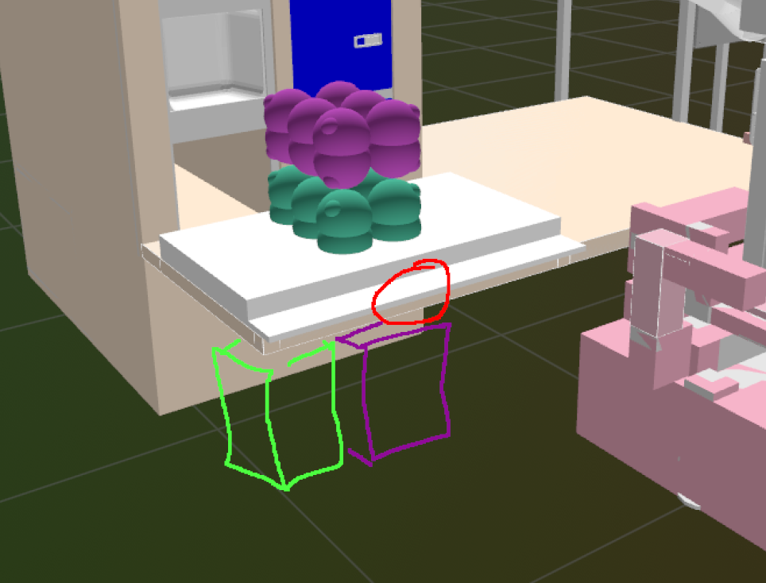
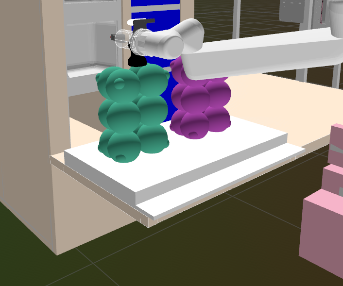
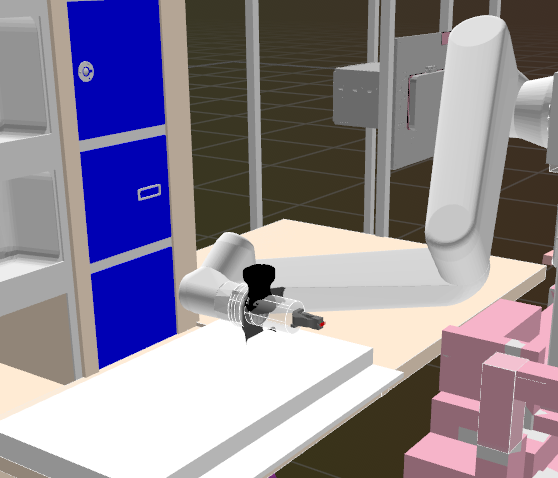
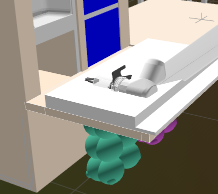

+++
title = "I'm a seeing-eye dog for a computer"
template = "post.html"
date = 2026-09-03
authors = ["Clayton Ramsey"]
description = "I'd rather argue with strangers on the Internet."
+++

<figure>

<figcaption>
Grab the lid on the spot that I circled in red.
</figcaption>

</figure>

I used to argue with people on the internet.
After about six replies, you realize that you're speaking to someone incapable of thought.
This is a more pleasant experience than getting a LLM to do what you want.

I write code for robots.
Rather, it's 2026, so these days I also tell LLMs to write code for robots.
I often handwrite the code myself, but I've found that LLM coding assistants' limitless patience ameliorates the drudgiest work of coding.
Since robots are real things, the gold standard in debugging is visualization: you demonstrate a robot solving the problem you specified and inspect the results with your eyeballs.

Debugging against a visualization is often one of the most annoying parts of writing robot code, since the best workflow you can get is just writing down some magic numbers, re-running your software, and then zooming around the output.
If the result is no good, you punch in some new magic numbers and pray for the best.

<figure>

<figcaption>
Not there.
Grab the lid on the lip, where I circled it.
</figcaption>

</figure>

Since I already like making LLMs handle drudgery for me, I decided to see if I could get my coding assistant to do all that for me.
After all, these models already come with an image encoder, and my [visualizer tool](https://rerun.io) comes with an MCP server.
If the LLM does the debugging loop for me, I can move on to doing better tasks, like staking out the breakroom for leftover pizza.

<figure>

<figcaption>
That's a little bit better.
Take the gripper down and flip it toward the lip.
</figcaption>
</figure>

My experience so far has been less than pleasant.
It seems that no amount of training on text can give a language model a good sense of what a normal, working robot does.
Beyond that, the tools exposed for coding assistants to control GUI software are limited at best.
I can zoom around the debug viewer and snap into one spot in the scene in five seconds flat, but for an MCP-powered assistant, just getting to the right view in the scene can take five minutes.
So, when I ask an LLM to debug a problem visually, I mostly just wait thirty minutes and then get a new, also-wrong answer.

All that's left is the dumbest workflow possible: I fire up the debug viewer myself, look around for weird mistakes, then take a screenshot and tell the language model how badly it messed up this time.
Eventually I just decided to do all the debugging work myself, so I would at least get to do the fun part too.

<figure>

<figcaption>
Oh, I give up.
</figcaption>

</figure>
