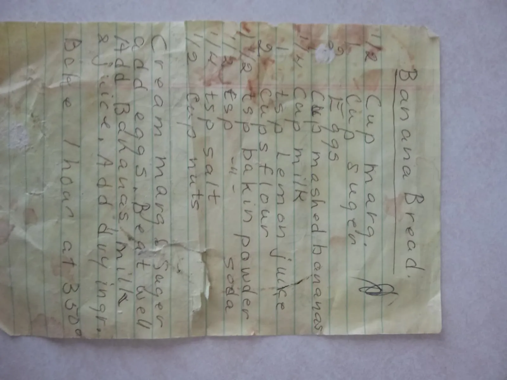

+++
title = "Jared's Banana Bread"
authors = ["Clayton Ramsey"]
description = "The best use for overripe bananas."
+++

<figure>

</figure>

I got this recipe from my friend and labmate Jared, who in turn got it from his grandmother.
You can see the original written recipe above.

## Ingredients

- 0.5 cups margarine (or butter)
- 1 cup sugar
- 2 eggs
- 1 cup mashed bananas
- 1/3 cup milk
- 1 tsp lemon juice
- 2 cups flour
- 0.5 tsp baking powder
- 0.5 tsp baking soda
- 0.25 tsp salt
- 0.5 cups nuts (typically pecans, chopped)

## Directions

1. Preheat oven to 350 F.
2. Cream margarine and sugar together.
   Add eggs and beat well.
   Add bananas, milk, and juice.
3. Add dry ingredients and fold.
   Do not overmix.
4. Pour batter into a bread mold.
   Bake for 1 hour, until a toothpick driven through the center comes out clean and the mold sounds hollow when knocked on the bottom.

## Notes

- The bananas must be overripe before mashing to prevent a stringy texture.
  Ideally, they should be completely brown and soft.
- If your bananas are not yet overripe, you can freeze and then thaw them to produce the same effect.
