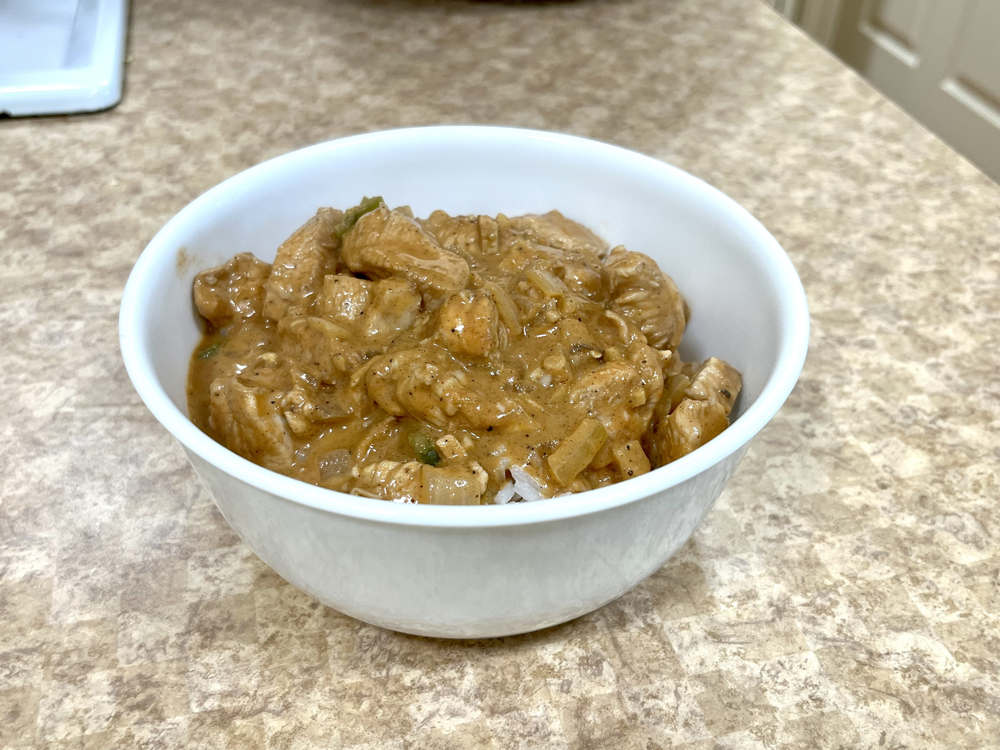

+++
title = "Chicken Tikka Masla"
authors = ["Clayton Ramsey"]
description = "An easy way to feed a lot of people."
+++

<figure>

</figure>

An easy way to feed a lot of people. I developed this recipe while in
undergrad as a way of making dinner without having too many dirty dishes
to clean up at the end.

This recipe is scaled to make around 6 servings and takes about 45
minutes.

## Ingredients

- Olive oil
- 1 medium onion, chopped
- 2 tbsp ginger, minced
- 4 cloves garlic, minced
- 1 tbsp garam masala
- 1 tbsp salt
- 1.5 tbsp cumin
- 1 tsp paprika
- 1 tsp black pepper
- 1 tsp cayenne pepper
- 0.25 tsp cinnamon
- 3 chicken breasts (2-3lb total), cut into 0.75" cubes
- 2 serrano peppers, diced
- 15 oz canned tomato sauce
- 1/3 cup water
- 1 tbsp cornstarch
- 1 cup heavy cream
- 2 cups rice (dry) or \~6 cups cooked

## Directions

1.  Add all the spices to a small bowl. Begin cooking rice.
2.  To a large pan, add oil and saute onions, ginger, garlic, and
    peppers until onions are clear.
3.  Add the spices and mix thoroughly, roughly 30 seconds.
4.  Add chicken, stirring regularly, until surface of chicken is seared
    slightly.
5.  Add tomato sauce, water, cornstarch, and heavy cream, then bring to
    a simmer. Simmer until rice is done, the longer the better.
6.  Serve hot over rice.

## Notes

- Substitute yogurt for heavy cream for a more acidic flavor.
- I do not bother measuring out any quantities for this recipe.
  It is sufficient to eyeball everything.
