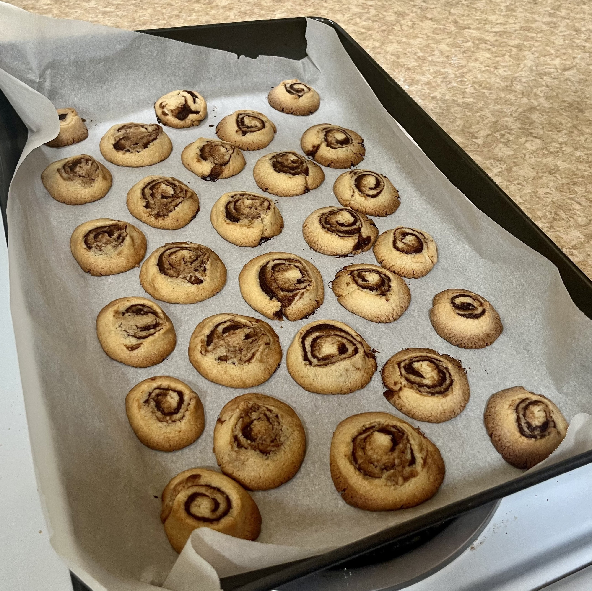

+++
title = "Cinnamon Roll Cookies"
authors = ["Clayton Ramsey"]
description = "These aren't really cinnamon rolls, but they aren't really cookies either."
+++

<figure>

</figure>

These aren't really cinnamon rolls, but they aren't really cookies
either. This recipe is scaled to make around 36 cookies and takes about
2 hours.

## Ingredients

### Dough

- 2 sticks butter, at room temperature
- 1 cup sugar
- 0.5 tsp salt
- 1 tbsp vanilla extract
- 1 egg
- 2.5 cups flour

### Filling

- 1 stick butter
- 0.5 cup brown sugar
- 4 tsp cinnamon
- 4 tsp cocoa powder
- 4 tsp flour
- 0.5 tsp salt
- 2 tsp vanilla extract

## Directions

1.  Combine the dough ingredients in a large bowl until mixed thoroughly
    and stretchy. Cover and let rest in the refrigerator for at least 1
    hour.
2.  Combine the filling ingredients. The filling should be wet and
    sticky.
3.  Preheat oven to 350 F.
4.  Retrieve dough from the refrigerator. Roll out into a flat sheet,
    roughly 6 inches wide and 1/8 inches thick. I recommend splitting
    the dough into 4 parts to make this process easier.
5.  Spread filling in a thin layer over the dough, leaving a 1 inch
    strip on the edge uncovered. Roll up the dough, starting from the
    uncovered strip, until you have a single roll, roughly 1.5 inches in
    diameter.
6.  Slice dough into rounds, roughly 1/4 inch thick. Cover a baking
    sheet in parchment paper and place the rounds on the sheet.
7.  Bake for 15 minutes or until golden brown.
