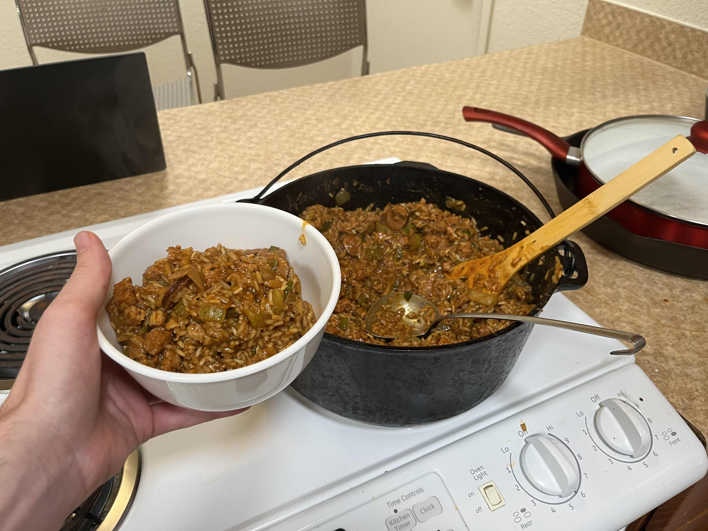

+++
title = "Jambalaya"
authors = ["Clayton Ramsey"]
description = "A spicy jambalaya recipe."
+++

<figure>

</figure>

A spicy jambalaya recipe. I got the base for this recipe from Matt and
Bobby, who were RAs for my dorm in undergrad, but I've made my own
modifications.

This recipe makes about 8 to 10 servings. It takes roughly 2 hours to
make.

## Ingredients

- 2 tbsp bacon fat
- 1.5 lb chicken, cubed
- 1.5 lb pork but, cubed
- 1 lb andouille sausage, sliced
- 8 tbsp ground paprika
- 6 tbsp ground cayenne pepper
- 5 tbsp ground black pepper
- 6 tbsp garlic powder
- 3 tbsp onion powder
- 6 tbsp salt
- 2.5 tbsp dried oregano
- 2.5 tbsp dried thyme
- 1 onion, chopped
- 1 head celery, chopped
- 2 bell peppers, chopped
- 1/4 cup garlic, minced
- 7 cups chicken stock
- 1 cup green onions, sliced
- 0.5 cup parsley, chopped
- 4 cups long grain rice, dry

## Directions

1.  In a large mixing bowl, combine meat and spices.
2.  Heat a large cast-iron Dutch oven on the stove and add bacon fat. If
    desired, you can simply fry some bacon in the pot to get your bacon
    fat.
3.  Sauté meat until dark brown and sticking to bottom of pan, approx.
    10 min.
4.  Add onions, celery, bell peppers, and garlic. Stir-fry 10 min.
5.  Add chicken stock and bring to a rolling boil, then reduce to a
    simmer for 15 min.
6.  Add green onions, parsley, and rice; stir thoroughly.
7.  Cover and let steam until rice is cooked, approx 30 min., stirring
    once at 15 min.
