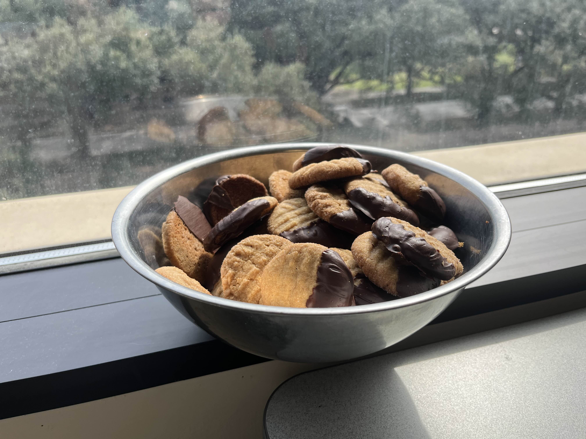

+++
title = "Peanut Butter Cookies"
authors = ["Clayton Ramsey"]
description = "Like snickerdoodles for peanut butter eaters."
+++

<figure>

</figure>

Like snickerdoodles for peanut butter eaters.
Yields 60 cookies.

## Ingredients

- 1 and 2/3 cups flour
- 1 tsp baking soda
- 0.5 tsp salt
- 1 cup (2 sticks) butter, softened
- 1 cup brown sugar
- 1/2 cup granulated sugar, plus extra
- 2 eggs
- 1.5 cups creamy peanut butter
- 2 tsp vanilla extract
- Cinnamon and other aromatic spices to taste
- 12 oz dark chocolate

## Directions

1. In a large mixing bowl, combine all ingredients except cinnamon, spices, and chocolate.
   The dough will be very soft - this is normal.
1. Pack dough into a ball and refrigerate at least 1 hour.
1. Preheat oven to 350° F.
1. Pour sugar, cinnamon, and other spices into a small bowl until you have a thin layer on the bottom.
   Roll dough into roughly 1" diameter balls, then roll the balls in the sugar and spices until completely covered.
   If you run out of the sugar mixture, make more.
1. Line a pan with parchment paper and arrange dough balls on them roughly 2" to 3" apart.
   Press the balls flat with a fork twice, making a "waffle" pattern on top.
1. Bake 12-15 minutes or until the edges of the cookies turn a golden brown.
1. Let cookies rest to room temperature.
1. Melt chocolate in a pot or microwave.
   Dip cookies in the chocolate.
1. Chill cookies in refrigerator until ready to serve.

## Notes

- In the baking process, you should overcook the cookies a bit.
  The edges will turn a deep brown and you will fear that you have burned them.
  Do not fear!
  This is the sugar on the outside caramelizing; it will lead to a much more interesting flavor.
- Optional spices might include allspice, ginger, pepper, or cardamom.
