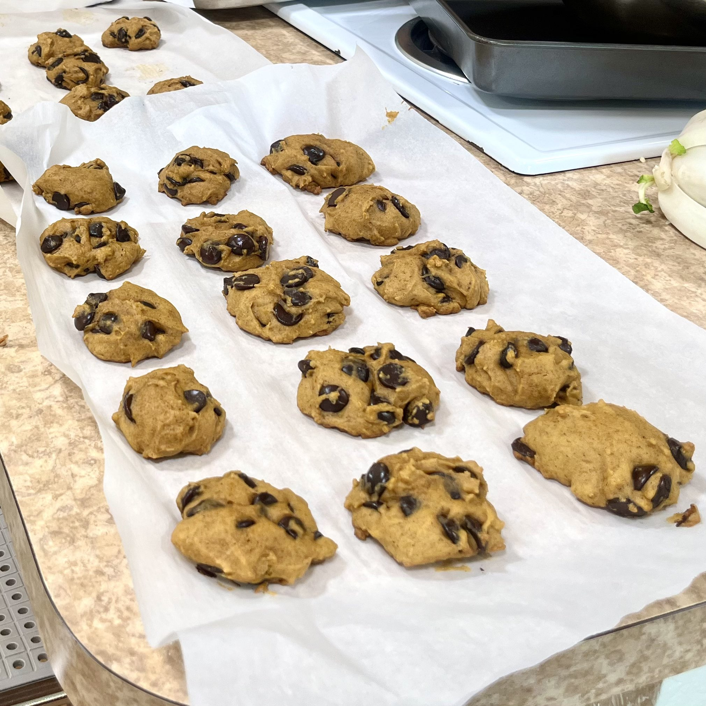

+++
title = "Ben's Pumpkin Cookies"
authors = ["Clayton Ramsey"]
description = "A really nice recipe for soft, tasty pumpkin cookies."
+++

<figure>

</figure>

A really nice recipe for soft, tasty pumpkin cookies. I adapted it from
one I found on [Ben Overmyer\'s
website](https://www.benovermyer.com/recipe/pumpkin-cookies/) with a few
modifications.

> those clayton cookies hit so hard 😭 i need them again frfr
>
> One of my friends after trying them

This recipe is scaled to make around 50 cookies and takes about 1 hour.

## Ingredients

- 1 15oz can pureed pumpkin
- 2 cups white sugar
- 1 cup vegetable oil
- 2 eggs
- 4 cups flour
- 4 tsp cinnamon
- 1 tsp nutmeg
- 1 tsp salt
- 4 tsp baking powder
- 2 tsp baking soda
- 2 tsp milk
- 2 tbsp vanilla extract
- 2 cups dark chocolate chips

## Directions

1.  Combine all ingredients except chocolate chips. The resulting dough
    should be noticeably softer and wetter than normal cookie dough.
2.  Seal in a plastic bag and let rest in the refrigerator at least 30
    minutes; preferably overnight.
3.  Preheat oven to 350° F.
4.  Mix chocolate chips into the dough.
5.  Cover a pan with parchment paper. Spoon out dough into medium-size
    balls, roughly 2 inches apart.
6.  Bake 15 minutes in the middle rack.
