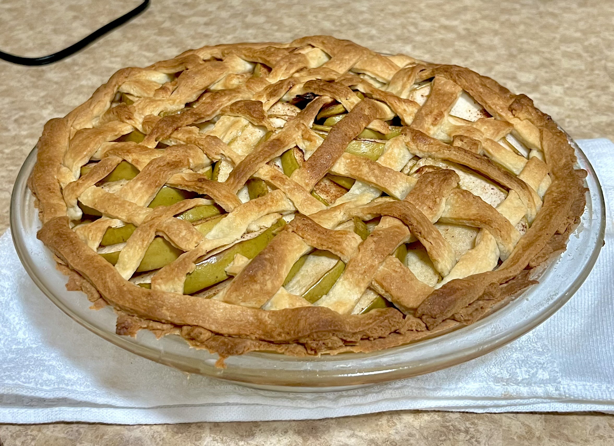

+++
title = "Greg's Pie Crust"
authors = ["Clayton Ramsey"]
description = "A simple crust that can be used for any dessert pie that you like."
+++

<figure>

</figure>

A simple crust that can be used for any dessert pie that you like. I
originally got this recipe from Greg, who was an RA at my dorm when I
was in undegrad.

This recipe should be enough to make at least one pie, but could even be
enough for two if you have a small tin. It takes roughly 2 hours to
make.

## Ingredients

- 2.5 cups flour
- 0.25 cups sugar
- 1 tsp salt
- 1 cup cold butter, cubed
- 0.5 cups + 1 tsp buttermilk
- 1 egg

## Directions

1.  Mix flour, salt, sugar, and butter until mixture resembles coarse
    meal.
2.  Mix in 0.5 cups buttermilk.
3.  Flatten into two disks, each roughly 1/4\" thick. Store in
    refrigerator at least 1 hour; preferably overnight.
4.  Preheat oven to 425° F.
5.  Prepare your preferred filling. Roll out the dough into a flat sheet
    and assemble the pie to your liking.
6.  Beat an egg with 1 tbsp buttermilk. Brush surface of pie with egg
    wash.
7.  Bake 15 minutes at 425° F, then reduce temperature to 350° F; bake
    40 minutes.
8.  Remove pie from oven; let cool for 30 minutes.

## Notes

- If you place the pie higher in the oven, it\'ll get a crispier top
  crust, which I prefer.
- The filling for a pie is much less a science than an art. I
  recommend getting roughly 3-5 pounds of fruit, cutting it into thin
  slices, and mixing it with cinnamon, brown sugar, and nutmeg.
  Arrange the slices in a geometric pattern inside the pie. Melt 0.5
  cups butter and mix in brown sugar until you have a thick syrup,
  then pour the syrup over the fruit.
  Add some flour if the filling is too wet.
